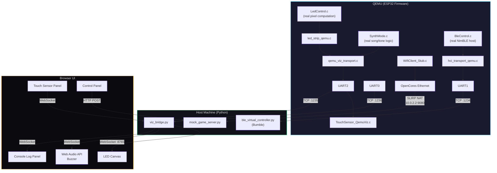
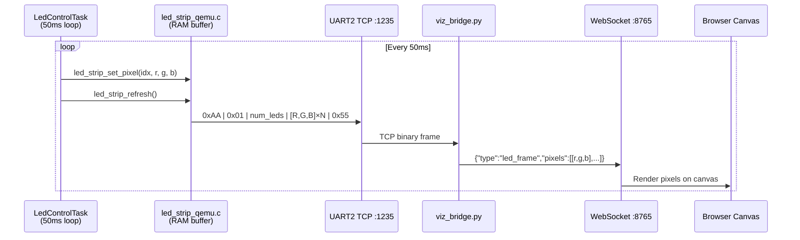
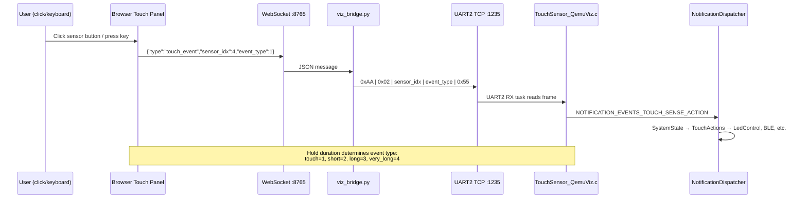
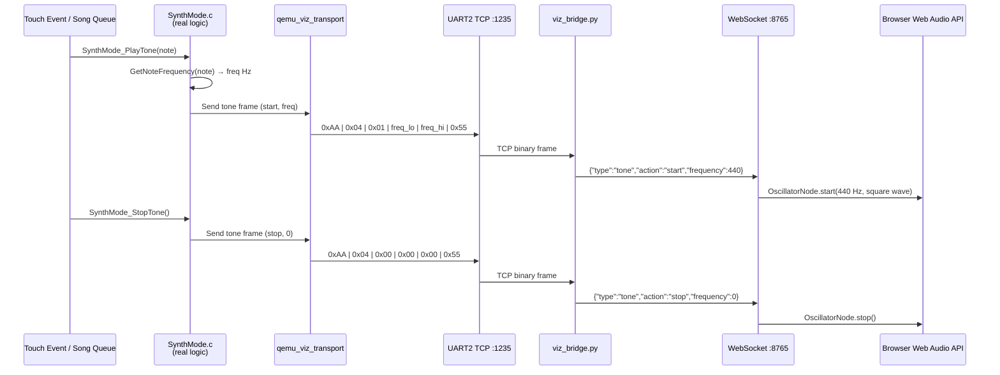
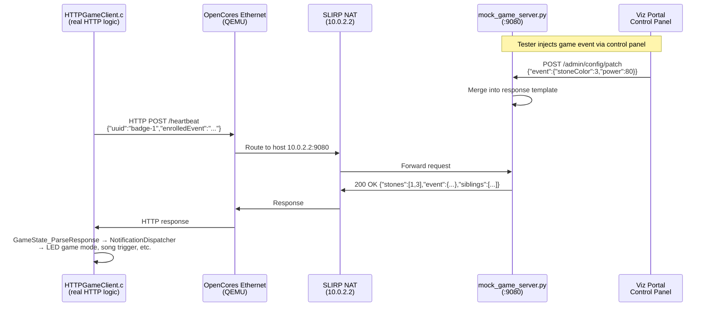
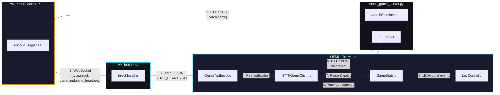

# SplinterOps Badge Firmware

Badge 2nd stage bootloader and application firmware for the SplinterOps conference badge. Supports four badge variants: **FMAN25**, **CREST**, **TRON**, and **REACTOR**.

[[_TOC_]]

## Getting Started

### Prerequisites

- **ESP-IDF v5.4.2** — [Installation guide](https://docs.espressif.com/projects/esp-idf/en/stable/esp32/get-started/)
- **Python 3.10+**
- Before running any ESP-IDF commands, activate the environment:
  ```bash
  get_idf
  ```

### Building

```bash
idf.py build
```

### Flashing

```bash
idf.py -p $(ls /dev/cu.usbserial-*) erase-flash
```

```bash
idf.py -p $(ls /dev/cu.usbserial-*) flash
```

<details>
<summary>All-in-one</summary>

```bash
idf.py -p $(ls /dev/cu.usbserial-*) erase-flash && idf.py -p $(ls /dev/cu.usbserial-*) flash
```

</details>

### Monitoring

```bash
idf.py -p $(ls /dev/cu.usbserial-*) monitor
```

---

## Project Structure

```
splinterops-badge-fw/
├── main/
│   ├── src/                    # Application source files
│   │   ├── stubs/              # QEMU-mode peripheral stubs & emulation layers
│   │   └── songs/              # Song note definitions
│   ├── inc/                    # Header files
│   ├── CMakeLists.txt          # Build config (conditional QEMU/real sources)
│   └── Kconfig.projbuild       # Kconfig options (CONFIG_BADGE_QEMU_MODE, etc.)
├── components/                 # Custom ESP-IDF components
│   └── console_cmds/           # Console command implementations
├── tools/
│   ├── viz_ui/                 # Browser-based visualization UI
│   │   ├── index.html          # Main UI page
│   │   ├── viz.js              # Visualization logic, WebSocket client, audio engine
│   │   └── badge_layouts.json  # LED positions & touch labels per badge variant
│   ├── viz_bridge.py           # Python bridge: QEMU UART ↔ WebSocket ↔ Browser
│   ├── mock_game_server.py     # Mock HTTP game server for WiFi emulation
│   ├── ble_virtual_controller.py  # Bumble-based virtual BLE controller
│   ├── run_viz.sh              # One-command launcher for the full viz stack
│   └── layouts/                # Badge LED layout CSV files
├── tests/                      # pytest-embedded QEMU test suite
├── docs/                       # Design & implementation plan documents
├── sdkconfig                   # Default sdkconfig (real hardware)
├── sdkconfig.ci.qemu           # QEMU-specific sdkconfig overlay
└── requirements-test.txt       # Python test/tool dependencies
```

---

## QEMU Emulation & Visualization

The project includes a full QEMU-based emulation environment that runs the badge firmware without physical hardware. Unsupported peripherals (touch sensors, WS2812 LEDs, piezo buzzer, BLE radio, WiFi) are replaced with functional emulation layers that communicate with an external browser-based visualization UI.

### Architecture Overview

```
┌──────────────────────────────────────────────────────────────────┐
│                     QEMU (ESP32 Firmware)                        │
│                                                                  │
│  Real LedControl.c ──→ led_strip_qemu.c ──→ UART2 TX (LED data)│
│  Real SynthMode.c  ──→ viz transport    ──→ UART2 TX (tone data)│
│  TouchSensor_QemuViz.c ←── UART2 RX (touch commands)           │
│  Real BleControl.c ──→ hci_transport_qemu.c ──→ UART1 (HCI)    │
│  WifiClient_Stub.c ──→ OpenCores Ethernet ──→ mock game server  │
│                                                                  │
│  UART0: Console logs    UART1: BLE HCI    UART2: Viz transport  │
└──────┬──────────────────────┬──────────────────┬─────────────────┘
       │                      │                  │
       │ TCP :1236            │ TCP :1234        │ TCP :1235
       ▼                      ▼                  ▼
┌──────────────┐  ┌────────────────────┐  ┌──────────────────────┐
│ viz_bridge.py│  │ble_virtual_        │  │ viz_bridge.py        │
│ (console log)│  │controller.py       │  │ (LED/touch/tone)     │
│              │  │ (Bumble HCI)       │  │                      │
└──────┬───────┘  └────────────────────┘  └──────────┬───────────┘
       │              WebSocket :8765                 │
       └──────────────────┬──────────────────────────┘
                          ▼
              ┌───────────────────────┐
              │  Browser UI (:8080)   │
              │  • LED canvas         │
              │  • Touch sensor panel │
              │  • Buzzer audio       │
              │  • Console logs       │
              │  • Control panel      │
              └───────────────────────┘
                          │
              ┌───────────────────────┐
              │ mock_game_server.py   │
              │  (:9080)              │
              │  • /heartbeat         │
              │  • /admin/* API       │
              │  • /update (OTA)      │
              └───────────────────────┘
```

### What Gets Emulated

| Subsystem | Emulation Strategy | Fidelity |
|-----------|-------------------|----------|
| **LED strip (WS2812)** | Real `LedControl.c` runs; `led_strip_qemu.c` captures pixel data and sends over UART2 to browser canvas | Full — all sequences, animations, game modes render |
| **Touch sensors** | `TouchSensor_QemuViz.c` receives touch commands from browser via UART2; fires real notification events | Full — all touch actions, combos, mode cycling work |
| **Piezo buzzer** | Real `SynthMode.c` runs; tone events sent over UART2; browser plays via Web Audio API square-wave oscillator | Full — touch tones, songs, timing all work |
| **BLE (NimBLE)** | Real BLE application code runs; HCI packets bridged over UART1 to Bumble virtual controller | Full — advertising, scanning, GATT, file transfer, IWC |
| **WiFi / HTTP** | OpenCores Ethernet (QEMU built-in) + `mock_game_server.py` replaces real game server | Full — heartbeat, game events, OTA download |
| **NVS / FAT filesystem** | Native QEMU support | Full |
| **Console / UART** | QEMU UART0 via TCP; streamed to browser console panel | Full |
| **Battery sensor (ADC)** | `BatterySensor_Stub.c` returns configurable mock voltage | Stub only |

### Emulation Data Flow Diagrams

#### System-Wide Architecture



#### LED Strip Emulation



#### Touch Sensor Emulation



#### Piezo Buzzer Emulation



#### BLE Emulation (HCI Bridge)

```mermaid
sequenceDiagram
    participant App as BleControl.c<br/>(real GATT/GAP)
    participant NimBLE as NimBLE Host Stack
    participant HCI as hci_transport_qemu.c
    participant UART as UART1 TCP :1234
    participant Bumble as Bumble Virtual Controller
    participant Link as Virtual Radio (LocalLink)
    participant Peer as Scripted Test Peer

    App->>NimBLE: ble_gap_adv_start()
    NimBLE->>HCI: HCI LE Set Advertising Parameters
    HCI->>UART: H4 frame → TCP
    UART->>Bumble: HCI command
    Bumble->>Link: Start advertising on virtual radio

    Peer->>Link: Scan for advertisements
    Link->>Peer: Advertisement found
    Peer->>Link: Connect request
    Link->>Bumble: Connection event
    Bumble->>UART: HCI LE Connection Complete
    UART->>HCI: H4 frame from TCP
    HCI->>NimBLE: Host receives connection event
    NimBLE->>App: GAP connect callback
```

#### WiFi / HTTP Emulation (Game Server)



#### Event Injection via Control Panel



### Quick Start

#### 1. Install Dependencies

```bash
# ESP-IDF environment
get_idf

# Install Espressif QEMU fork
python $IDF_PATH/tools/idf_tools.py install qemu-xtensa

# Install Python dependencies
pip install -r requirements-test.txt
```

#### 2. Launch the Visualization Stack

The `run_viz.sh` script handles everything — building, flash image creation, starting the mock server, BLE controller, viz bridge, and QEMU:

```bash
./tools/run_viz.sh
```

This will:
1. Build the firmware with QEMU mode enabled (`CONFIG_BADGE_QEMU_MODE=y`)
2. Create a merged 16 MB flash image for QEMU
3. Start the mock game server on port **9080**
4. Start the Bumble virtual BLE controller on port **1234**
5. Start the visualization bridge (WebSocket on **8765**, HTTP on **8080**)
6. Start QEMU with all three serial ports connected
7. Open the browser UI at **http://localhost:8080**

Press **Ctrl+C** to stop all services.

#### Options

```bash
./tools/run_viz.sh --no-build              # Skip build, use existing flash image
./tools/run_viz.sh --badge CREST           # Select badge variant (FMAN25|CREST|TRON|REACTOR)
./tools/run_viz.sh --viz-port 1235         # Custom UART2 viz port
./tools/run_viz.sh --ws-port 8765          # Custom WebSocket port
./tools/run_viz.sh --http-port 8080        # Custom HTTP UI port
```

#### 3. Manual Launch (Step by Step)

If you prefer to run each component individually:

```bash
# Build with QEMU config
rm -rf build
idf.py -DSDKCONFIG_DEFAULTS="sdkconfig.old;sdkconfig.ci.qemu" set-target esp32
idf.py build

# Create flash image
cd build
esptool.py --chip esp32 merge_bin --output flash_image.bin @flash_args
truncate -s $((16 * 1024 * 1024)) flash_image.bin
cd ..

# Start mock game server
python3 tools/mock_game_server.py --port 9080 &

# Start Bumble virtual BLE controller
python3 tools/ble_virtual_controller.py --port 1234 &

# Start visualization bridge
python3 tools/viz_bridge.py \
    --qemu-port 1235 --console-port 1236 \
    --ws-port 8765 --http-port 8080 --badge FMAN25 &

# Start QEMU
~/.espressif/tools/qemu-xtensa/esp_develop_9.0.0_20240606/qemu/bin/qemu-system-xtensa \
    -nographic -machine esp32 -m 4M \
    -drive file=build/flash_image.bin,if=mtd,format=raw \
    -serial tcp:localhost:1236 \
    -serial tcp:localhost:1234,nodelay \
    -serial tcp:localhost:1235,server,nowait \
    -nic user,model=open_eth
```

Then open **http://localhost:8080** in your browser.

---

### Browser Visualization UI

The visualization UI is a single-page web app served by the viz bridge at `http://localhost:8080`. It provides a real-time view of the badge's state.

#### Layout

```
┌─────────────────────────────────────────────────────────────────┐
│ SPLINTEROPS BADGE VISUALIZER                          [FMAN25] │
├────────────┬───────────────────────────┬────────────────────────┤
│            │                           │  Touch Sensors         │
│  CONTROL   │      LED Canvas           │  Status                │
│  PANEL     │   (real-time pixel        │  Buzzer (vol/mute)     │
│            │    rendering)             │  Event Log             │
│  [Game]    │                           │                        │
│  [OTA]     │                           │                        │
│  [Peers]   │                           │                        │
│  [Keys]    │                           │                        │
│  [Server]  │                           │                        │
├────────────┴───────────────────────────┴────────────────────────┤
│ Console Logs (filterable by level and tag)                      │
└─────────────────────────────────────────────────────────────────┘
```

#### Features

- **LED Canvas** — Renders all LEDs in the badge's physical layout (inner/outer rings) with real-time RGB colors at ~20 fps
- **Touch Sensor Panel** — Clickable buttons for each of the 9 touch sensors; supports click (touch+release), click-and-hold (short/long/very-long press), and keyboard shortcuts (keys `1`–`9`)
- **Buzzer Audio** — Plays tones through the browser using Web Audio API square-wave oscillator; includes volume slider and mute toggle
- **Console Logs** — Streams firmware UART0 output with log level filtering (Error/Warn/Info/Debug/Verbose) and tag filtering
- **Event Log** — Shows touch events, mode changes, and connection status
- **Status Panel** — Displays current LED mode, inner/outer state, and frame count
- **Badge Selector** — Switch between FMAN25, CREST, TRON, and REACTOR layouts

#### Keyboard Shortcuts (Touch Sensors)

Keys `1`–`9` map to the badge's touch sensors left-to-right:

| Key | FMAN25 | CREST | TRON | REACTOR |
|-----|--------|-------|------|---------|
| `1` | L1 | LW1 | 12 o'clock | 12 o'clock |
| `2` | L2 | LW2 | 1 o'clock | 1 o'clock |
| `3` | L3 | LW3 | 2 o'clock | 2 o'clock |
| `4` | L4 | LW4 | 4 o'clock | 4 o'clock |
| `5` | Center | Tail | 5 o'clock | 5 o'clock |
| `6` | R4 | RW4 | 7 o'clock | 7 o'clock |
| `7` | R3 | RW3 | 8 o'clock | 8 o'clock |
| `8` | R2 | RW2 | 10 o'clock | 10 o'clock |
| `9` | R1 | RW1 | 11 o'clock | 11 o'clock |

Hold a key for 1s+ for short press, 3s+ for long press, 5s+ for very long press.

---

### Control Panel

The left sidebar control panel allows injecting game events and manipulating the mock server without restarting QEMU or editing JSON files.

#### Game Events

Inject game events that the badge receives on its next heartbeat:

- **Presets** — Quick buttons for common scenarios: Join Red Event (5min), Join Cyan Event (10min), Complete Event (fanfare), Clear Event, Unlock All Stones, Unlock All Songs
- **Custom** — Set stone color, power level, duration, event ID, individual stone/song unlocks
- **Apply & Trigger HB** — Patches the mock server response and immediately triggers a heartbeat
- **Apply (wait)** — Patches the response; badge picks it up on its next natural heartbeat

#### OTA Update

- Enable/disable the mock OTA endpoint with dummy payloads (1 MB or 4 MB) or a custom binary path
- The badge checks for OTA on WiFi connect; trigger a heartbeat to initiate

#### Peers / Siblings

- Add/remove peer badge UUIDs that appear in heartbeat responses
- Quick-add 5 random peers or clear all
- Auto-populated from the badge registry (badges that have sent heartbeats)

#### Touch Commands Reference

A dynamic reference table showing all touch combinations for the selected badge type, including the corresponding keyboard shortcuts. Updates when you switch badge variants.

#### Server State

Displays the current mock server state: badges online, last heartbeat time, OTA status, and active event configuration. Polls `GET /admin/state` on the mock server.

---

### Mock Game Server

`tools/mock_game_server.py` provides a configurable HTTP server that replaces the real game server for QEMU testing.

#### Endpoints

| Endpoint | Method | Description |
|----------|--------|-------------|
| `/heartbeat` | POST | Badge heartbeat — returns game state (events, stones, songs, siblings) |
| `/update` | GET | OTA firmware download (when enabled) |
| `/admin/config` | GET | Return current response template |
| `/admin/config` | POST | Replace the response template |
| `/admin/config/patch` | POST | Merge (patch) fields into current template |
| `/admin/peers` | POST | Set the siblings list |
| `/admin/ota/enable` | POST | Enable OTA endpoint with binary or dummy payload |
| `/admin/ota/disable` | POST | Disable OTA endpoint |
| `/admin/state` | GET | Return full server state (config, badges, OTA status) |
| `/admin/trigger/heartbeat` | POST | Signal to trigger a heartbeat (relayed via viz bridge) |

#### Standalone Usage

```bash
python3 tools/mock_game_server.py --port 9080
python3 tools/mock_game_server.py --port 9080 --response-file tools/mock_responses/heartbeat_event_join.json
```

The QEMU guest reaches the host at `10.0.2.2` (QEMU SLIRP NAT convention). The mock server URL is configured in `sdkconfig.ci.qemu` as `http://10.0.2.2:9080/heartbeat`.

---

### Visualization Bridge

`tools/viz_bridge.py` is the central relay between QEMU and the browser UI.

#### What It Does

- **UART2 TCP → WebSocket**: Parses binary LED frames, mode changes, and tone events from QEMU; converts to JSON and broadcasts to all connected WebSocket clients
- **WebSocket → UART2 TCP**: Receives touch events and inject commands from the browser; encodes as binary frames and sends to QEMU
- **UART0 TCP → WebSocket**: Reads console log lines from QEMU; parses ESP-IDF log levels; forwards to browser console panel
- **HTTP Server**: Serves the `tools/viz_ui/` static files

#### Binary Protocol (UART2)

All messages use a simple framed format:

| Direction | Message | Type Byte | Payload |
|-----------|---------|-----------|---------|
| FW → UI | LED Frame | `0x01` | `uint16 num_leds` + `[R,G,B] × N` |
| UI → FW | Touch Event | `0x02` | `uint8 sensor_idx` + `uint8 event_type` |
| FW → UI | Mode Change | `0x03` | `uint8 mode` + `uint8 inner` + `uint8 outer` |
| FW → UI | Tone Event | `0x04` | `uint8 action` + `uint16 frequency` |
| UI → FW | Test Inject | `0x05` | `uint8 sub_command` |

Each frame is wrapped with `0xAA` (start) and `0x55` (end) markers.

#### Standalone Usage

```bash
python3 tools/viz_bridge.py \
    --qemu-port 1235 \
    --console-port 1236 \
    --ws-port 8765 \
    --http-port 8080 \
    --badge FMAN25 \
    --verbose
```

---

### QEMU Build Configuration

The QEMU build uses `sdkconfig.ci.qemu` as an overlay on top of the base `sdkconfig`. Key settings:

| Setting | Value | Purpose |
|---------|-------|---------|
| `CONFIG_BADGE_QEMU_MODE` | `y` | Enables peripheral stubs and emulation layers |
| `CONFIG_ETH_USE_OPENETH` | `y` | OpenCores Ethernet for network (replaces WiFi) |
| `CONFIG_BT_ENABLED` | `y` | Bluetooth enabled (NimBLE host stack) |
| `CONFIG_BT_CONTROLLER_DISABLED` | `y` | No ESP32 BT controller (uses HCI bridge instead) |
| `CONFIG_ESP_TASK_WDT_EN` | `n` | Disable watchdog timers for cleaner QEMU output |
| `CONFIG_SPIRAM` | `y` | PSRAM enabled (QEMU supports via `-m 4M`) |
| `CONFIG_QEMU_HEARTBEAT_URL` | `http://10.0.2.2:9080/heartbeat` | Mock server URL via SLIRP NAT |
| `CONFIG_QEMU_OTA_URL` | `http://10.0.2.2:9080/update` | Mock OTA URL |

A **clean build is required** when switching between normal and QEMU mode:

```bash
rm -rf build
idf.py -DSDKCONFIG_DEFAULTS="sdkconfig.old;sdkconfig.ci.qemu" set-target esp32
idf.py build
```

---

### Running Tests

The project uses `pytest-embedded` with QEMU support for automated testing.

```bash
# Install test dependencies
pip install -r requirements-test.txt

# Run all QEMU tests
cd tests/
pytest --target esp32 --embedded-services idf,qemu
```

Test files cover boot validation, BLE file transfer, BLE interactive game, and more. See `tests/` for the full suite.

---

## Documentation

Detailed design documents are in the `docs/` directory:

- **`QEMU_IMPLEMENTATION_PLAN.md`** — Base QEMU setup, HAL/stub layer, test framework integration
- **`TOUCH_LED_EMULATION_PLAN.md`** — LED strip and touch sensor emulation via UART2 + browser UI
- **`PIEZO_BUZZER_EMULATION_PLAN.md`** — Piezo buzzer sound emulation via Web Audio API
- **`BLE_EMULATION_PLAN.md`** — BLE stack emulation via HCI bridging to Bumble virtual controller
- **`VIZ_PORTAL_INJECTION_PLAN.md`** — Control panel for event injection and mock server manipulation