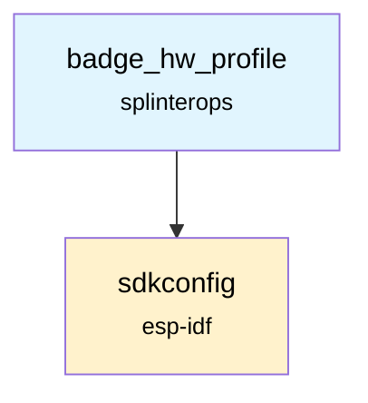

# Badge Hardware Profile Component

The Badge Hardware Profile component selects and exposes the active badge hardware profile at build time and provides a small API for querying the profile name and touch button layout, as well as a helper for the BLE device name.

## Overview

This component conditionally includes one of several per-badge profiles based on Kconfig options, e.g. `CONFIG_BADGE_TYPE_TRON`, `CONFIG_BADGE_TYPE_REACTOR`, `CONFIG_BADGE_TYPE_CREST`, or `CONFIG_BADGE_TYPE_FMAN25`. Each profile defines:

- `BADGE_PROFILE_NAME` – Human-readable badge name
- `BLE_DEVICE_NAME` – Default BLE device name string
- A touch button map and count for that hardware

The public API abstracts these details so the rest of the firmware can remain profile-agnostic.

## Features

- **Config-selectable profiles**: Choose active profile via `sdkconfig`
- **Unified API**: Query name, BLE device name, and touch button map
- **Per-badge maps**: Each profile defines its own touch layout and size

## API Functions

### `const char* BadgeHwProfile_Name(void)`
Returns the human-readable name of the active hardware profile.

### `const int* BadgeHwProfile_TouchButtonMap(void)`
Returns a pointer to the const touch button map for the active profile.

### `int BadgeHwProfile_TouchButtonMapSize(void)`
Returns the number of touch buttons for the active profile.

### `void GetBadgeBleDeviceName(char* buffer, uint32_t bufferSize)`
Copies the default BLE device name into `buffer` (null-terminated within `bufferSize`).

## Usage Example

```c
#include "BadgeHwProfile.h"

void app_use_profile(void) {
    const char* name = BadgeHwProfile_Name();
    const int* map = BadgeHwProfile_TouchButtonMap();
    int mapSize = BadgeHwProfile_TouchButtonMapSize();

    char bleName[32] = {0};
    GetBadgeBleDeviceName(bleName, sizeof(bleName));

    ESP_LOGI("PROFILE", "Active: %s, buttons: %d, BLE: %s", name, mapSize, bleName);
    for (int i = 0; i < mapSize; ++i) {
        ESP_LOGI("PROFILE", "Button %d -> channel %d", i, map[i]);
    }
}
```

## Dependencies



## Component Structure

```
components/badge_hw_profile/
├── CMakeLists.txt      # Component build configuration
├── BadgeHwProfile.c    # Public API implementation
├── BadgeHwProfile.h    # Public API
├── BadgeType.c         # Badge type enumeration (if needed)
├── BadgeType.h         # Badge type definitions
├── crest/              # Crest profile (BadgeProfile.h/.c)
├── fman25/             # FMAN25 profile (BadgeProfile.h/.c)
├── reactor/            # Reactor profile (BadgeProfile.h/.c)
└── tron/               # Tron profile (BadgeProfile.h/.c)
```

## Notes

- The default profile falls back to FMAN25 if no `CONFIG_BADGE_TYPE_*` is selected (see `BadgeHwProfile.h`).
- Each profile directory defines `BADGE_PROFILE_NAME`, `BLE_DEVICE_NAME`, and the touch sensor button enum and map.
