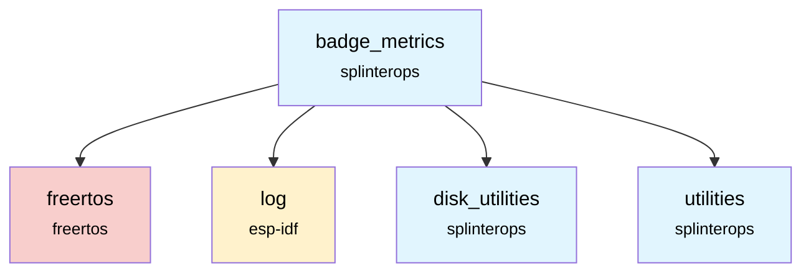

# Badge Metrics Component

The `badge_metrics` component is responsible for tracking various usage statistics and events that occur on the badge.

## Overview

This component provides a centralized way to record metrics such as power-on cycles, user interactions, and BLE activity. It uses a mutex to ensure that metric increments are thread-safe. The collected data can be used for diagnostics, user engagement features, or analytics.

## Features

- **Comprehensive Metrics**: Tracks a wide range of statistics including power-ons, touches, LED cycles, and BLE transfers.
- **Thread-Safe**: Uses a FreeRTOS mutex to protect access to the metrics structure, allowing safe updates from multiple tasks.
- **Extensible**: New metrics can be easily added to the `BadgeStatsFile` struct.

## API Functions

### `esp_err_t BadgeMetrics_Init(BadgeMetrics *this)`
Initializes the badge metrics component, setting up the mutex and zeroing out the initial stats.

**Parameters:**
- `this`: Pointer to the `BadgeMetrics` instance.

**Returns:** `ESP_OK` on success.

### `void BadgeMetrics_Increment... (BadgeMetrics *this)`
A series of functions to increment specific metrics, such as:
- `BadgeMetrics_IncrementNumPowerOns()`
- `BadgeMetrics_IncrementNumTouches()`
- `BadgeMetrics_IncrementNumBleSeqXfers()`
- ...and others.

**Parameters:**
- `this`: Pointer to the `BadgeMetrics` instance.

## Dependencies



## Component Structure

```
components/badge_metrics/
├── CMakeLists.txt    # Component build configuration
├── BadgeMetrics.c    # Implementation
├── BadgeMetrics.h    # Public API
└── README.md         # This documentation
```
