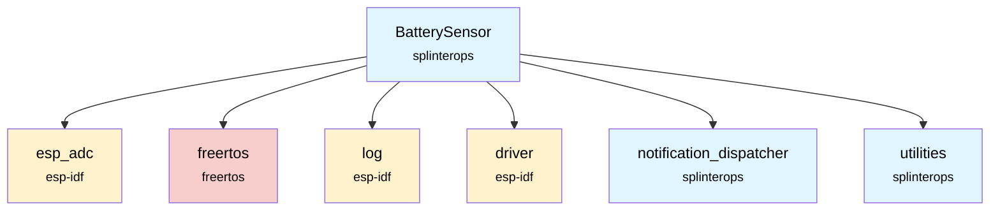
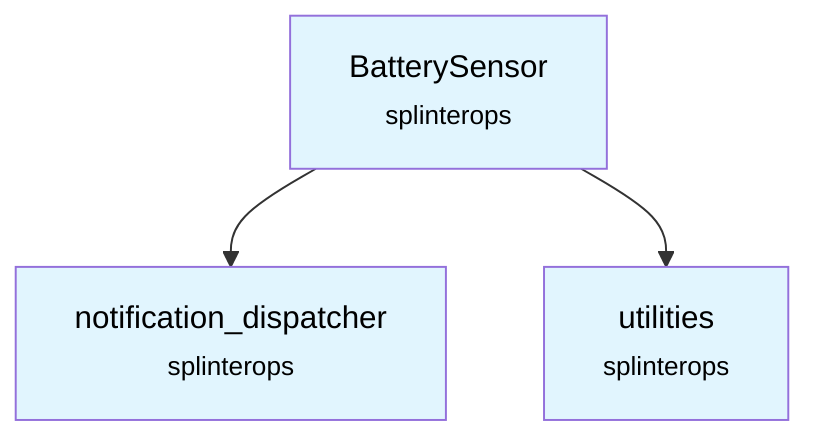

# BatterySensor Component

The BatterySensor component provides battery voltage monitoring and percentage calculation for the badge firmware, enabling power management and low-battery notifications through continuous ADC sampling.

## Overview

The BatterySensor component monitors the badge's battery voltage using the ESP32's ADC (Analog-to-Digital Converter) with hardware calibration. It runs as a dedicated FreeRTOS task that continuously samples the battery voltage, calculates the battery percentage, and provides thread-safe access to battery status information.

## Features

- **Continuous monitoring**: Dedicated task samples battery voltage every 5 seconds
- **Hardware calibration**: Uses ESP32 ADC calibration for accurate voltage readings
- **Thread-safe access**: Mutex-protected battery percentage retrieval
- **Multisampling**: Averages 64 ADC readings for noise reduction
- **Voltage divider support**: Handles external voltage divider circuits
- **Configurable task parameters**: Customizable priority and CPU core assignment

## API Functions

### `BatterySensor_Init(BatterySensor *this, NotificationDispatcher *pNotificationDispatcher, int adcChannel, int priority, int cpuNumber)`
Initializes the battery sensor with ADC configuration and starts the monitoring task.

**Parameters:**
- `this`: Pointer to BatterySensor instance
- `pNotificationDispatcher`: Pointer to notification dispatcher for events
- `adcChannel`: ADC channel to use for battery voltage measurement
- `priority`: FreeRTOS task priority for the battery monitoring task
- `cpuNumber`: CPU core to run the monitoring task on (0 or 1)

**Returns:** `ESP_OK` on success, error code otherwise

### `BatterySensor_GetBatteryPercent(BatterySensor *this)`
Returns the current battery percentage as an integer.

**Parameters:**
- `this`: Pointer to BatterySensor instance

**Returns:** Battery percentage (0-100), or -1 on error

## Hardware Configuration

The component is configured for the following hardware setup:

- **ADC Unit**: ADC1
- **ADC Channel**: Channel 7 (GPIO35)
- **Attenuation**: 12dB (supports up to ~3.3V input)
- **Voltage Divider**: 2:1 ratio (measures up to ~6.6V battery)
- **Battery Range**: 3.0V (0%) to 4.18V (100%)

## Usage Example

```c
#include "BatterySensor.h"
#include "NotificationDispatcher.h"

// Initialize components
BatterySensor batterySensor;
NotificationDispatcher notificationDispatcher;

// Initialize notification dispatcher first
NotificationDispatcher_Init(&notificationDispatcher, 100, 5, APP_CPU_NUM);

// Initialize battery sensor
esp_err_t result = BatterySensor_Init(&batterySensor, &notificationDispatcher, 
                                     ADC_CHANNEL_7, BATT_SENSE_TASK_PRIORITY, APP_CPU_NUM);
if (result == ESP_OK) {
    ESP_LOGI("BATTERY", "Battery sensor initialized successfully");
} else {
    ESP_LOGE("BATTERY", "Failed to initialize battery sensor");
}

// Get battery percentage
int batteryPercent = BatterySensor_GetBatteryPercent(&batterySensor);
if (batteryPercent >= 0) {
    ESP_LOGI("BATTERY", "Battery level: %d%%", batteryPercent);
} else {
    ESP_LOGE("BATTERY", "Failed to read battery level");
}
```

## Dependencies



## Component Structure

```
components/battery_sensor/
├── CMakeLists.txt    # Component build configuration
├── BatterySensor.c   # Implementation
├── BatterySensor.h   # Public API
└── README.md        # This documentation
```

## ADC Calibration

The component supports multiple ADC calibration schemes:

1. **Curve Fitting**: More accurate, available on ESP32-S2 and later
2. **Line Fitting**: Basic calibration, available on all ESP32 variants

The component automatically selects the best available calibration method during initialization.

## Thread Safety

The BatterySensor uses a mutex (`batteryPercentMutex`) to ensure thread-safe access to battery percentage data. The monitoring task updates the values while other tasks can safely read them through the API functions.

## Performance Characteristics

- **Sampling rate**: Every 5 seconds
- **ADC resolution**: 12-bit (4096 levels)
- **Multisampling**: 64 samples averaged per reading
- **Voltage accuracy**: ±50mV typical (with calibration)
- **Task overhead**: Minimal - sleeps between samples


## Voltage Calculation

Battery voltage is calculated using the formula:
```
Battery Voltage = (ADC_mV / 1000) × DIVIDER_VALUE
```

Where:
- `ADC_mV`: Calibrated ADC reading in millivolts
- `DIVIDER_VALUE`: Hardware voltage divider ratio (2:1)

Battery percentage is calculated as:
```
Percentage = ((min(Battery_Voltage, BAT_MAX) - BAT_MIN) × 100) / (BAT_MAX - BAT_MIN)
```

## SplinterOps Dependency Tree


