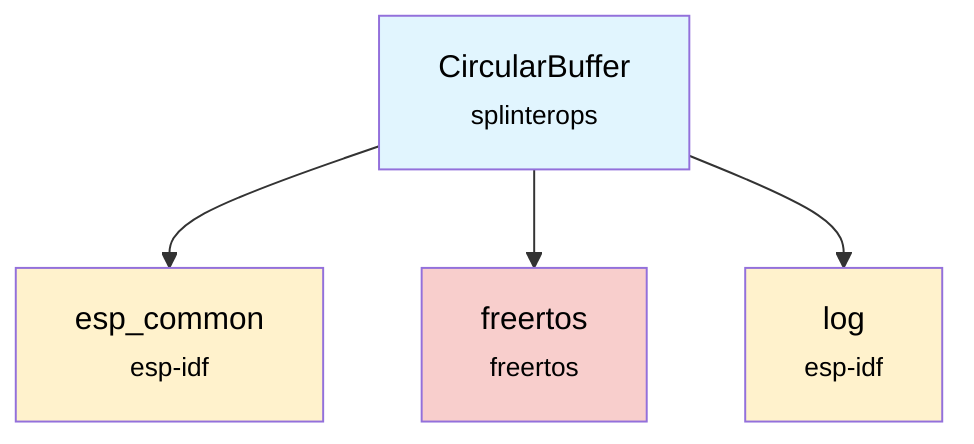

# CircularBuffer Component

The CircularBuffer component provides a generic circular buffer implementation for the badge firmware, enabling efficient FIFO (First In, First Out) data storage with fixed memory allocation.

## Overview

The CircularBuffer is a data structure that uses a fixed-size buffer as if it were connected end-to-end. It provides efficient insertion and removal operations at both ends, making it ideal for buffering data streams, implementing queues, and pattern matching operations.

## Features

- **Fixed-size allocation**: Pre-allocates memory to avoid dynamic allocation during runtime
- **Generic data storage**: Supports any data type through configurable element size
- **FIFO operations**: Push to back, pop from front with O(1) complexity
- **Pattern matching**: Built-in sequence matching for the last N elements
- **Overflow protection**: Prevents buffer overruns with capacity checking
- **Memory management**: Proper cleanup and reset functionality

## API Functions

### `CircularBuffer_Init(CircularBuffer *cb, size_t capacity, size_t size)`
Initializes a circular buffer with specified capacity and element size.

**Parameters:**
- `cb`: Pointer to CircularBuffer instance
- `capacity`: Maximum number of elements the buffer can hold
- `size`: Size of each element in bytes

**Returns:** `ESP_OK` on success, `ESP_FAIL` if memory allocation fails

### `CircularBuffer_Free(CircularBuffer *cb)`
Frees the memory allocated for the circular buffer and resets the structure.

**Parameters:**
- `cb`: Pointer to CircularBuffer instance

**Returns:** None

### `CircularBuffer_Clear(CircularBuffer *cb)`
Clears all elements from the buffer and resets pointers without deallocating memory.

**Parameters:**
- `cb`: Pointer to CircularBuffer instance

**Returns:** None

### `CircularBuffer_Count(CircularBuffer *cb)`
Returns the current number of elements in the buffer.

**Parameters:**
- `cb`: Pointer to CircularBuffer instance

**Returns:** Number of elements currently stored

### `CircularBuffer_PushBack(CircularBuffer *cb, const void *item)`
Adds an element to the back of the buffer.

**Parameters:**
- `cb`: Pointer to CircularBuffer instance
- `item`: Pointer to the item to be added

**Returns:** `ESP_OK` on success, `ESP_FAIL` if buffer is full

### `CircularBuffer_PopFront(CircularBuffer *cb, void *item)`
Removes and returns an element from the front of the buffer.

**Parameters:**
- `cb`: Pointer to CircularBuffer instance
- `item`: Pointer to destination where the popped item will be copied

**Returns:** `ESP_OK` on success, `ESP_FAIL` if buffer is empty

### `CircularBuffer_MatchSequence(CircularBuffer *cb, const void *sequence, size_t sequenceLength)`
Checks if the last N elements in the buffer match a given sequence.

**Parameters:**
- `cb`: Pointer to CircularBuffer instance
- `sequence`: Pointer to the sequence to match
- `sequenceLength`: Number of elements in the sequence

**Returns:** `ESP_OK` if sequence matches, `ESP_FAIL` otherwise

## Usage Example

```c
#include "CircularBuffer.h"

// Initialize buffer for integers
CircularBuffer intBuffer;
CircularBuffer_Init(&intBuffer, 10, sizeof(int));

// Push some values
int values[] = {1, 2, 3, 4, 5};
for (int i = 0; i < 5; i++) {
    CircularBuffer_PushBack(&intBuffer, &values[i]);
}

// Pop a value
int poppedValue;
if (CircularBuffer_PopFront(&intBuffer, &poppedValue) == ESP_OK) {
    ESP_LOGI("CBUF", "Popped value: %d", poppedValue);
}

// Check for sequence match
int sequence[] = {2, 3, 4, 5};
if (CircularBuffer_MatchSequence(&intBuffer, sequence, 4) == ESP_OK) {
    ESP_LOGI("CBUF", "Sequence found!");
}

// Cleanup
CircularBuffer_Free(&intBuffer);
```

## Dependencies



## Component Structure

```
components/circular_buffer/
├── CMakeLists.txt    # Component build configuration
├── CircularBuffer.c  # Implementation
├── CircularBuffer.h  # Public API
└── README.md        # This documentation
```

## Memory Management

The CircularBuffer allocates a contiguous block of memory during initialization:
- **Memory size**: `capacity × element_size` bytes
- **Allocation**: Single `malloc()` call during `CircularBuffer_Init()`
- **Deallocation**: Single `free()` call during `CircularBuffer_Free()`

## Thread Safety

**Note**: This implementation is **not thread-safe**. If multiple tasks need to access the same CircularBuffer concurrently, external synchronization (mutexes, semaphores) must be used.

## Performance Characteristics

- **Push/Pop operations**: O(1) time complexity
- **Count operation**: O(1) time complexity
- **Sequence matching**: O(n) where n is sequence length
- **Memory overhead**: Minimal - only stores pointers and counters

## Use Cases

- **Audio buffering**: Store audio samples for processing
- **Sensor data**: Buffer sensor readings for analysis
- **Pattern detection**: Detect specific sequences in data streams (e.g., Ocarina note patterns)
- **Communication**: Buffer incoming/outgoing data packets
