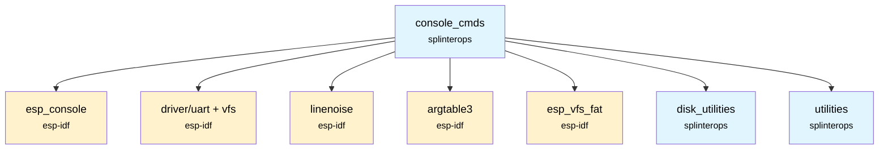
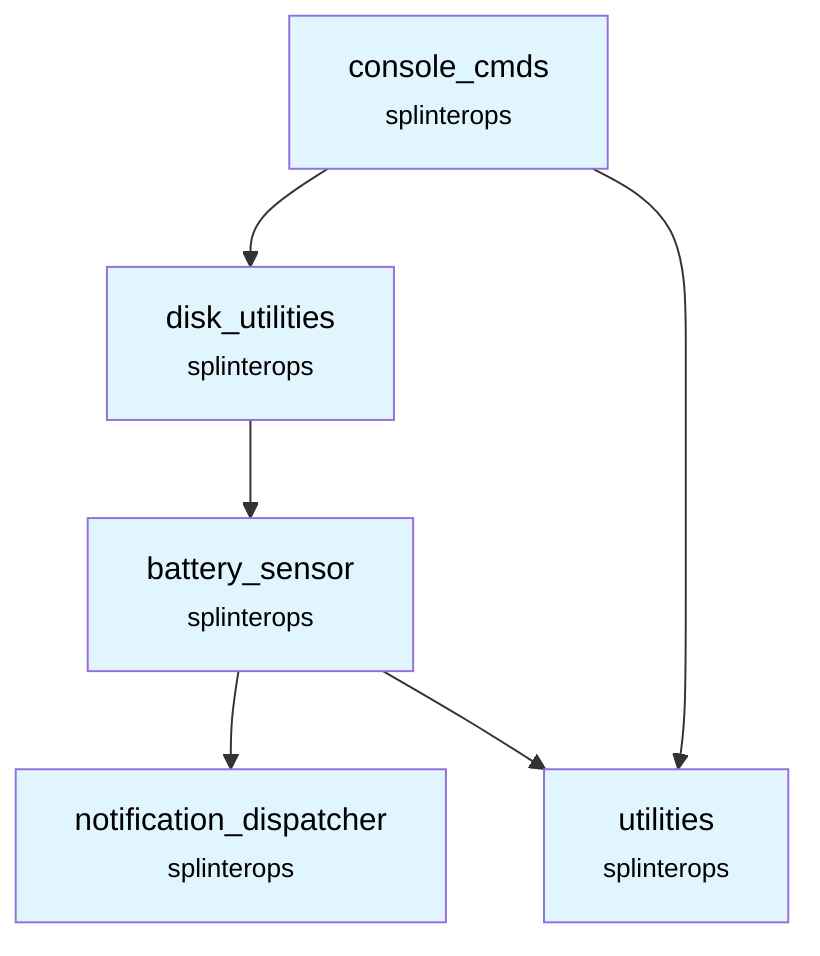

# Console Commands Component

The Console Commands component provides a UART-based interactive console for the badge firmware using ESP-IDF's `esp_console`, along with a set of system and badge-specific commands.

## Overview

This component initializes the console over UART, integrates `linenoise` for line editing and history, and registers built-in help plus system and (optionally) badge commands. Command history persistence can be enabled via Kconfig and stored on a mounted filesystem.

## Features

- **UART console**: Configurable baud rate and target via Kconfig
- **Line editing and history**: Powered by `linenoise`
- **Built-in help**: Registers standard ESP-IDF help command
- **Pluggable commands**: Registers system basic/dev commands and optional badge commands
- **Optional history persistence**: Saves/loads history to mounted filesystem when enabled

## API Functions

### `esp_err_t Console_Init(int consolePriority)`
Initializes the console subsystem and starts a FreeRTOS task which handles user input and command execution.

- Initializes UART and routes VFS to the UART driver
- Configures `esp_console` and `linenoise`
- Registers system commands
- Creates the console task pinned to `APP_CPU_NUM`

## System and Badge Command Registration

From `console_cmds/system_cmds/`:
- `void register_system_basic(void)` – Registers basic system commands
- `void register_system_dev(void)` – Registers developer/system diagnostics commands (guarded by `CONFIG_DEBUG_FEATURES`)

From `console_cmds/badge_cmds/` (optional):
- `void register_badge_commands(void)` – Registers badge-specific commands

## Usage Example

```c
#include "Console.h"

void app_start_console(void)
{
    ESP_ERROR_CHECK(Console_Init(5));
}
```

## Kconfig Options

- `CONFIG_ESP_CONSOLE_UART_NUM` – UART port for console
- `CONFIG_ESP_CONSOLE_UART_BAUDRATE` – UART baud rate
- `CONFIG_CONSOLE_STORE_HISTORY` – Enable saving/loading command history
- `CONFIG_MOUNT_PATH` – Base mount path used for history file when enabled
- `CONFIG_DEBUG_FEATURES` – Enable registration of developer commands

## Dependencies



## Component Structure

```
components/console_cmds/
├── CMakeLists.txt          # Component build configuration
├── README.md               # This documentation
├── console/                # Console init/task (Console.c/.h)
├── system_cmds/            # System commands (console_system.c/.h)
└── badge_cmds/             # Badge-specific commands (console_badge.c/.h)
```

## Notes

- USB CDC console is not supported (`CONFIG_ESP_CONSOLE_USB_CDC` incompatible path is guarded).
- History persistence requires a mounted filesystem at `CONFIG_MOUNT_PATH`.

## SplinterOps Dependency Tree


