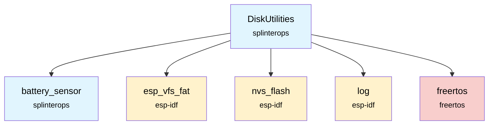
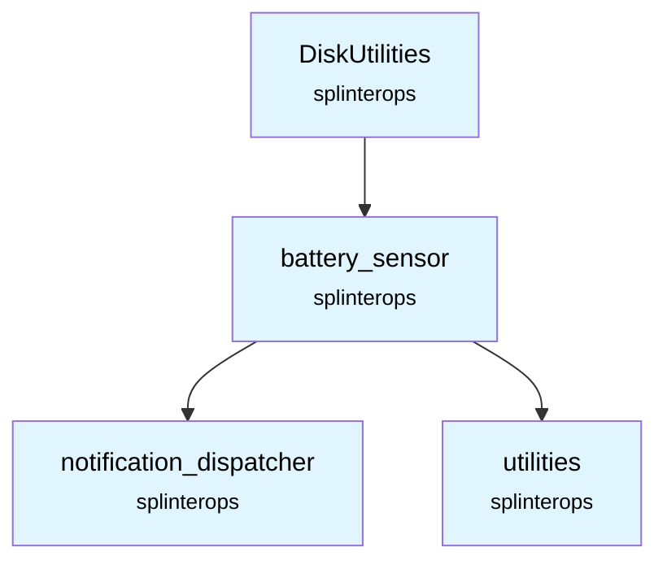

# DiskUtilities Component

The DiskUtilities component provides functions for initializing and managing the non-volatile storage (NVS) and the FAT filesystem on the badge's internal flash.

## Overview

This component abstracts the low-level details of initializing NVS and mounting the FAT filesystem. It also provides helper functions for reading from and writing to files, with an added safety check to prevent flash writes when the battery is low.

## Features

- **NVS Initialization**: Initializes the non-volatile storage system, with automatic erasing and re-initialization if corruption is detected.
- **FAT Filesystem Mounting**: Mounts a FAT filesystem on the SPI flash, with an option to format if the mount fails.
- **Safe File Writes**: Prevents file writes if the battery level is below a safe threshold to avoid data corruption.
- **File I/O Helpers**: Provides simple functions to read and write entire files.

## API Functions

### `DiskUtilities_InitNvs(void)`
Initializes the NVS flash storage.

**Returns:** `ESP_OK` on success, or an error code on failure.

### `DiskUtilities_InitFs(void)`
Initializes and mounts the FAT filesystem.

**Returns:** `ESP_OK` on success, or an error code on failure.

### `ReadFileFromDisk(char *filename, char *buffer, int bufferSize, int *pReadBytes, int expectedFileSize)`
Reads a file from the disk into a buffer.

**Parameters:**
- `filename`: The name of the file to read.
- `buffer`: The buffer to store the file contents.
- `bufferSize`: The size of the buffer.
- `pReadBytes`: A pointer to store the number of bytes read.
- `expectedFileSize`: The expected size of the file. If `> 0`, the read will only succeed if the file size matches.

**Returns:** `ESP_OK` on success, `ESP_FAIL` on failure.

### `WriteFileToDisk(BatterySensor *pBatterySensor, char *filename, char *buffer, int bufferSize)`
Writes a buffer to a file on disk, checking battery level first.

**Parameters:**
- `pBatterySensor`: A pointer to the `BatterySensor` instance.
- `filename`: The name of the file to write to.
- `buffer`: The data to write.
- `bufferSize`: The number of bytes to write.

**Returns:** `ESP_OK` on success, `ESP_FAIL` on failure.

## Dependencies

## SplinterOps Dependency Tree

