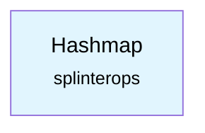

# Hashmap Component

A generic hashmap implementation for ESP-IDF projects.

## Overview

This component provides a type-safe, generic hashmap implementation using C macros. It's based on the hashmap library by David Leeds and is licensed under the MIT license.

## Features

- **Type-safe**: Uses C macros to provide compile-time type safety
- **Generic**: Works with any uniqueKey and data types
- **Efficient**: Uses open addressing with linear probing
- **Iterator support**: Provides safe iteration over hashmap entries
- **Memory efficient**: Automatically resizes based on load factor

## Files

- `hashmap.h` - Main hashmap interface and macros
- `hashmap_base.h` - Base hashmap structure definitions
- `hashmap.c` - Core hashmap implementation

## Usage

### Declaration

```c
#include "hashmap.h"

// Declare a hashmap type
HASHMAP(int, char*) my_map;

// Initialize the hashmap
hashmap_init(&my_map, hashmap_hash_default, hashmap_compare_default);
```

### Basic Operations

```c
// Put a uniqueKey-value pair
hashmap_put(&my_map, &key, &value);

// Get a value by key
char* value = hashmap_get(&my_map, &key);

// Remove a key-value pair
hashmap_remove(&my_map, &key);

// Check if key exists
if (hashmap_get(&my_map, &key)) {
    // Key exists
}
```

### Iteration

```c
// Iterate over all key-value pairs
int *key;
char **data;
hashmap_foreach(key, data, &my_map) {
    printf("Key: %d, Value: %s\n", *key, *data);
}
```

### Cleanup

```c
// Free the hashmap
hashmap_cleanup(&my_map);
```

## Hash Functions

The library provides several built-in hash functions:

- `hashmap_hash_default()` - Jenkins one-at-a-time hash
- `hashmap_hash_string()` - String hash function
- `hashmap_hash_string_i()` - Case-insensitive string hash

## Thread Safety

This hashmap implementation is **not** thread-safe. If you need to use it in a multi-threaded environment, you must provide your own synchronization mechanisms.

## Dependencies

This component has no external component dependencies.



## License

MIT License - see the source files for full license text.
