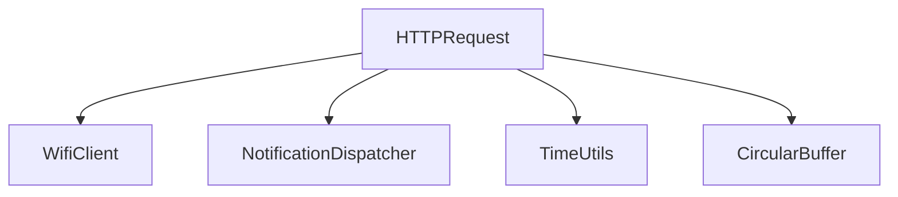

# HTTP Request Component

This component provides HTTP request functionality for the SplinterOps badge firmware. It handles GET and POST requests and manages response handling.

## SplinterOps Dependency Tree

