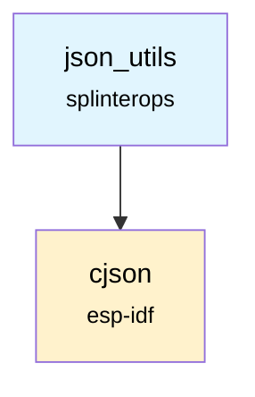

# JSON Utilities Component

The `json_utils` component provides helper functions for parsing and validating JSON strings using the `cJSON` library.

## Overview

This component abstracts common JSON operations, such as checking for validity and extracting specific values from a JSON payload. It is designed to be a lightweight wrapper around the `cJSON` library for specific use cases within the badge firmware.

## Features

- **JSON Validation**: Quickly check if a string is a valid JSON document.
- **Value Extraction**: Helper function to parse a JSON string and extract a specific key's value.

## API Functions

### `bool JsonUtils_ValidateJson(const char * json)`
Validates if the provided string is a well-formed JSON document.

**Parameters:**
- `json`: A pointer to the character string to validate.

**Returns:** `true` if the JSON is valid, `false` otherwise.

### `esp_err_t GetSharecodeFromJson(char * custom_led_sequence, char * share_code, int share_code_size)`
Parses a JSON string to extract the value associated with the `"c"` key, typically used for sharecodes.

**Parameters:**
- `custom_led_sequence`: The JSON string to parse.
- `share_code`: A buffer to store the extracted sharecode.
- `share_code_size`: The size of the `share_code` buffer.

**Returns:** `ESP_OK` on success, `ESP_FAIL` if parsing fails or the key is not found.

## Dependencies



## Component Structure

```
components/json_utils/
├── CMakeLists.txt    # Component build configuration
├── JsonUtils.c       # Implementation
├── JsonUtils.h       # Public API
└── README.md         # This documentation
```
