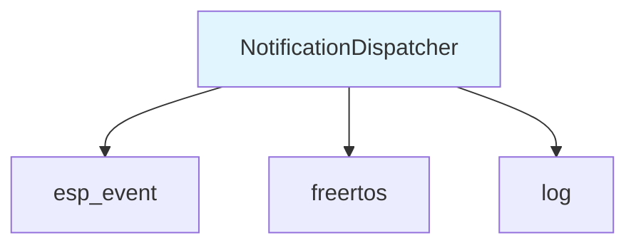

# NotificationDispatcher Component

The NotificationDispatcher component provides a centralized event management system for the badge firmware, enabling decoupled communication between different modules through a publish-subscribe pattern.

## Overview

The NotificationDispatcher creates a dedicated FreeRTOS event loop that handles various badge events such as touch actions, BLE operations, WiFi connectivity, OTA updates, and interactive game events. This allows different components to communicate without direct dependencies.

## Features

- **Event-driven architecture**: Decouples components through event publishing/subscribing
- **Thread-safe operations**: Uses mutexes to ensure safe concurrent access
- **Configurable event loop**: Customizable task priority, stack size, and core assignment
- **Comprehensive event types**: Supports 20+ different notification event types

## API Functions

### `NotificationDispatcher_Init(NotificationDispatcher *this, esp_event_loop_args_t *touchTaskArgs)`
Initializes the notification dispatcher with custom event loop configuration.

**Parameters:**
- `this`: Pointer to NotificationDispatcher instance
- `touchTaskArgs`: Event loop configuration (queue size, task name, priority, stack size, core ID)

**Returns:** `ESP_OK` on success, error code otherwise

### `NotificationDispatcher_NotifyEvent(NotificationDispatcher *this, int notificationEvent, void *data, int dataSize, uint32_t waitDurationMSec)`
Posts an event to the notification system.

**Parameters:**
- `this`: Pointer to NotificationDispatcher instance
- `notificationEvent`: Event type (from NotificationEvent enum)
- `data`: Optional event data payload
- `dataSize`: Size of data payload in bytes
- `waitDurationMSec`: Maximum time to wait if queue is full

**Returns:** `ESP_OK` on success, `ESP_ERR_TIMEOUT` if queue full, `ESP_ERR_INVALID_ARG` for invalid parameters

### `NotificationDispatcher_RegisterNotificationEventHandler(NotificationDispatcher *this, int notificationEvent, esp_event_handler_t eventHandler, void *eventHandlerArgs)`
Registers an event handler for a specific notification type.

**Parameters:**
- `this`: Pointer to NotificationDispatcher instance
- `notificationEvent`: Event type to handle
- `eventHandler`: Callback function to handle the event
- `eventHandlerArgs`: Optional arguments passed to handler

**Returns:** `ESP_OK` on success, error code otherwise

## Event Types

The component supports the following notification events (defined in `NotificationEvents.h`):

- Touch sensor events (TOUCH_SENSE_ACTION, TOUCH_ENABLED, etc.)
- BLE service events (BLE_SERVICE_ENABLED, BLE_CONNECTED, etc.)
- WiFi events (WIFI_ENABLED, WIFI_CONNECTED, etc.)
- OTA update events (OTA_REQUIRED, OTA_DOWNLOAD_COMPLETE, etc.)
- Game events (GAME_EVENT_JOINED, INTERACTIVE_GAME_ACTION, etc.)
- Audio events (PLAY_SONG, OCARINA_SONG_MATCHED, etc.)

## Usage Example

```c
#include "NotificationDispatcher.h"
#include "NotificationEvents.h"

// Initialize the dispatcher
NotificationDispatcher dispatcher;
esp_event_loop_args_t loopArgs = {
    .queue_size = 100,
    .task_name = "NotificationsEventLoop",
    .task_priority = 5,
    .task_stack_size = configMINIMAL_STACK_SIZE * 3,
    .task_core_id = APP_CPU_NUM
};
NotificationDispatcher_Init(&dispatcher, &loopArgs);

// Register an event handler
static void wifi_event_handler(void* arg, esp_event_base_t event_base, int32_t event_id, void* event_data) {
    ESP_LOGI("WIFI", "WiFi connected event received");
}
NotificationDispatcher_RegisterNotificationEventHandler(&dispatcher, 
    NOTIFICATION_EVENTS_WIFI_CONNECTED, wifi_event_handler, NULL);

// Send a notification
NotificationDispatcher_NotifyEvent(&dispatcher, 
    NOTIFICATION_EVENTS_WIFI_CONNECTED, NULL, 0, 100);
```

## Dependencies



## Component Structure

```
components/notification_dispatcher/
├── CMakeLists.txt          # Component build configuration
├── NotificationDispatcher.c # Implementation
├── NotificationDispatcher.h # Public API
└── README.md              # This documentation
```

## Thread Safety

The NotificationDispatcher uses a mutex (`notifyMutex`) to ensure thread-safe access to the event posting mechanism. Multiple tasks can safely post events concurrently without data corruption.

## Configuration

The event loop can be configured through the `esp_event_loop_args_t` structure:
- **queue_size**: Number of events that can be queued (default: 100)
- **task_priority**: FreeRTOS task priority for event processing
- **task_stack_size**: Stack size for the event loop task
- **task_core_id**: CPU core to run the event loop on (APP_CPU_NUM recommended)
