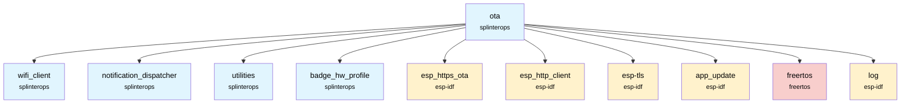
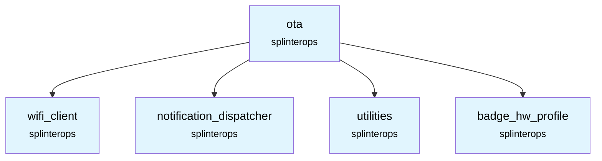

# OTA Update Component

Provides periodic over-the-air firmware update checks and upgrades using HTTPS OTA on ESP-IDF.

## Overview

`ota` starts a background FreeRTOS task which periodically:
- Requests WiFi connectivity via `wifi_client`
- Queries a badge-specific update URL
- Compares running image vs server image
- If different, downloads and applies the update, then reboots
- Publishes notification events at key points (available, download start, download complete)

Badge type is appended to the configured base URL via preprocessor defines (e.g., `_TRON`, `_REACTOR`, `_CREST`, `_FMAN25`). Certificates are handled via ESP-IDF CRT bundle.

## Features

- **Periodic checks:** configurable interval with WiFi on-demand
- **HTTPS OTA:** uses `esp_https_ota` with CRT bundle
- **Version comparison:** compares ELF SHA-256 of running image vs update
- **Event notifications:** update-available, download-initiated, download-completed
- **Rollback awareness:** optional cancel rollback when system is healthy

## API

### `esp_err_t OtaUpdate_Init(OtaUpdate *this, WifiClient *pWifiClient, NotificationDispatcher * pNotificationDispatcher, int priority, int cpuNumber, int updateAvailableEventId, int downloadInitiatedEventId, int downloadCompletedEventId)`
Initializes and starts the OTA task pinned to the requested core with the given priority.

- `this`: Component instance (will be zeroed and initialized)
- `pWifiClient`: WiFi client handle for connectivity requests
- `pNotificationDispatcher`: Dispatcher for publishing notifications
- `priority`: FreeRTOS task priority
- `cpuNumber`: Core to pin the task to
- `updateAvailableEventId`: Event ID to publish when a new version is detected
- `downloadInitiatedEventId`: Event ID to publish when download starts
- `downloadCompletedEventId`: Event ID to publish when download completes (success or failure)

## Configuration

Kconfig options referenced by code:
- `CONFIG_OTA_UPDATE_URL`: Base HTTPS URL for update metadata/image (badge suffix is appended)
- `CONFIG_OTA_UPDATE_RECV_TIMEOUT`: HTTP receive timeout (ms)
- `CONFIG_BOOTLOADER_APP_ROLLBACK_ENABLE`: Enable anti-rollback (optional)

Timing constants are compiled in:
- Check delay: 1 hour between checks (see `OTA_CHECK_DELAY_HOURS`)
- WiFi wait time: immediate (0 ms) by default

## Dependencies



## Integration

Add to your main component CMake:

```cmake
idf_component_register(
    # ... your sources
    REQUIRES ota
)
```

Initialize during system bring-up (example from `main/src/SystemState.c`):

```c
ESP_ERROR_CHECK(OtaUpdate_Init(&this->otaUpdate,
                               &this->wifiClient,
                               &this->notificationDispatcher,
                               OTA_UPDATE_TASK_PRIORITY,
                               APP_CPU_NUM,
                               NOTIFICATION_EVENTS_OTA_UPDATE_AVAILABLE,
                               NOTIFICATION_EVENTS_OTA_DOWNLOAD_INITIATED,
                               NOTIFICATION_EVENTS_OTA_DOWNLOAD_COMPLETE));
```

## Notes

- On successful upgrade, device reboots after a 1s delay.
- If the server image matches the running image (SHA-256), the update is skipped.
- HTTP client uses CRT bundle and keeps connections alive; redirects are not followed.

## Component Structure

```
components/ota/
├── CMakeLists.txt      # Component build configuration
├── OtaUpdate.c         # OTA implementation
├── OtaUpdate.h         # Public API
└── README.md           # This documentation
```

## SplinterOps Dependency Tree


