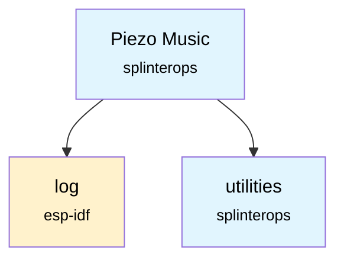

# Piezo Music Component

A music playback component for piezo buzzers in ESP-IDF projects, featuring Zelda-themed songs and musical note definitions.

## Overview

This component provides musical note definitions, song data structures, and a collection of pre-defined songs primarily from The Legend of Zelda series. It's designed to work with piezo buzzers for audio output on embedded systems.

## Features

- **Musical Note Definitions**: Complete note frequency definitions including sharps and flats
- **Song Structure**: Flexible song format with tempo, note types, and slur support
- **Pre-defined Songs**: Collection of Zelda-themed songs and sound effects
- **Note Type Support**: Various note durations from whole notes to sixty-fourth notes
- **Tempo Control**: Configurable tempo for each song

## Files

- `Notes.h` - Musical note frequency definitions and note name enumerations
- `Song.h` - Song data structures, note types, and function declarations
- `Songs.c` - Song implementations and song retrieval functions

## Song Collection

The component includes the following songs:

### Sound Effects
- Secret Sound
- Success Sound  
- Chest Sound

### Zelda Songs
- Zelda Opening
- Zelda Theme
- Zelda's Lullaby
- Epona's Song
- Song of Storms
- Saria's Song
- Sun's Song
- Song of Time
- Minuet of Forest
- Bolero of Fire
- Serenade of Water
- Nocturne of Shadow
- Requiem of Spirit
- Prelude of Light

### Additional Songs
- Bonus tracks
- Fanfare
- Right Round
- Margaritaville

## Usage

### Getting a Song

```c
#include "Song.h"

// Get a specific song
const SongNotes* song = GetSong(SONG_ZELDA_THEME);

// Access song properties
printf("Song: %s\n", song->songName);
printf("Tempo: %d BPM\n", song->tempo);
printf("Number of notes: %d\n", song->numNotes);
```

### Playing Notes

```c
// Iterate through song notes
for (int i = 0; i < song->numNotes; i++) {
    Note note = song->notes[i];
    
    // Get note duration in milliseconds
    int duration = GetNoteTypeInMilliseconds(song->tempo, note.noteType);
    
    // Play the note (implementation depends on your piezo driver)
    play_note(note.note, duration, note.slur);
}
```

### Note Types

The component supports various note durations:

```c
NOTE_TYPE_WHOLE            // Whole note (1.0)
NOTE_TYPE_HALF             // Half note (0.5)
NOTE_TYPE_QUARTER          // Quarter note (0.25)
NOTE_TYPE_EIGHTH           // Eighth note (0.125)
NOTE_TYPE_SIXTEENTH        // Sixteenth note (0.0625)
NOTE_TYPE_THIRTY_SECOND    // Thirty-second note
NOTE_TYPE_SIXTY_FOURTH     // Sixty-fourth note

// Dotted notes
NOTE_TYPE_HALF_DOT         // Dotted half note
NOTE_TYPE_QUARTER_DOT      // Dotted quarter note
NOTE_TYPE_EIGHTH_DOT       // Dotted eighth note

// Triplets
NOTE_TYPE_QUARTER_TRIPLET  // Quarter note triplet
```

### Song Enumeration

```c
typedef enum Song_e {
    SONG_NONE = -1,
    SONG_SECRET_SOUND,
    SONG_SUCCESS_SOUND,
    SONG_CHEST_SOUND,
    SONG_ZELDA_OPENING,
    SONG_ZELDA_THEME,
    // ... more songs
    NUM_SONGS
} Song;
```

## Data Structures

### Note Structure
```c
typedef struct Note_t {
    NoteName note;      // The musical note (frequency)
    NoteType noteType;  // Duration of the note
    int slur;          // Slur flag for smooth transitions
} Note;
```

### Song Structure
```c
typedef struct SongNotes_t {
    const char songName[SONG_MAX_NAME_LENGTH];  // Song name
    int tempo;                                  // Beats per minute
    int numNotes;                              // Number of notes in song
    Note notes[SONG_MAX_NOTES];               // Array of notes
} SongNotes;
```

## Dependencies

- ESP-IDF `log` component for logging functionality
- `Utilities.h` (referenced in Songs.c)



## Integration

To use this component in your project, include it in your main component's CMakeLists.txt:

```cmake
idf_component_register(
    # ... your sources
    REQUIRES piezo_music
)
```

Then include the headers in your code:

```c
#include "Song.h"
#include "Notes.h"
```
