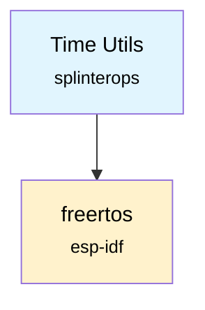

# Time Utils Component

A FreeRTOS time utility component providing convenient functions for time calculations and timeout management.

## Overview

This component provides utility functions for working with FreeRTOS tick counts, converting between ticks and milliseconds, and managing timeouts. It simplifies common time-related operations in embedded applications.

## Features

- **Elapsed Time Calculation**: Calculate elapsed time between tick counts
- **Timeout Management**: Check if a timeout has expired
- **Time Conversion**: Convert between ticks and milliseconds
- **Future Time Calculation**: Calculate future tick counts for timeouts
- **Current Time Access**: Get current system tick count

## Files

- `TimeUtils.h` - Component interface and function declarations
- `TimeUtils.c` - Implementation of time utility functions

## Usage

### Include Header

```c
#include "TimeUtils.h"
```

### Measuring Elapsed Time

```c
// Record start time
TickType_t startTime = TimeUtils_GetCurTimeTicks();

// Do some work...
vTaskDelay(pdMS_TO_TICKS(1000)); // Simulate 1 second of work

// Calculate elapsed time
uint32_t elapsedMs = TimeUtils_GetElapsedTimeMSec(startTime);
printf("Operation took %lu ms\n", elapsedMs);
```

### Timeout Management

```c
// Set a timeout for 5 seconds from now
TickType_t timeoutTicks = TimeUtils_GetFutureTimeTicks(5000);

while (!operation_complete()) {
    // Check if timeout has expired
    if (TimeUtils_IsTimeExpired(timeoutTicks)) {
        printf("Operation timed out!\n");
        break;
    }
    
    // Continue working...
    vTaskDelay(pdMS_TO_TICKS(100));
}
```

### Time Conversions

```c
// Convert milliseconds to ticks for delays
uint32_t delayMs = 500;
TickType_t delayTicks = pdMS_TO_TICKS(delayMs);

// Convert ticks back to milliseconds
uint32_t convertedMs = TimeUtils_GetMSecFromTicks(delayTicks);
```

## API Reference

### Functions

#### `TimeUtils_GetElapsedTimeMSec(TickType_t startTime)`
Calculates elapsed time in milliseconds since a start time.

**Parameters:**
- `startTime`: Starting tick count (from previous call to `TimeUtils_GetCurTimeTicks()`)

**Returns:**
- Elapsed time in milliseconds as `uint32_t`

#### `TimeUtils_IsTimeExpired(TickType_t endTime)`
Checks if a timeout has expired (inclusive check).

**Parameters:**
- `endTime`: Future tick count representing the timeout

**Returns:**
- `true` if the timeout has expired or is exactly at the current time
- `false` if the timeout is still in the future

#### `TimeUtils_GetFutureTimeTicks(uint32_t mSec)`
Calculates a future tick count based on current time plus milliseconds.

**Parameters:**
- `mSec`: Milliseconds to add to current time

**Returns:**
- Future tick count as `TickType_t`

#### `TimeUtils_GetCurTimeTicks(void)`
Gets the current system tick count.

**Returns:**
- Current tick count as `TickType_t`

#### `TimeUtils_GetMSecFromTicks(uint32_t ticks)`
Converts tick count to milliseconds.

**Parameters:**
- `ticks`: Tick count to convert

**Returns:**
- Equivalent time in milliseconds as `uint32_t`

## Usage Patterns

### Performance Measurement

```c
void measure_function_performance(void) {
    TickType_t start = TimeUtils_GetCurTimeTicks();
    
    // Function to measure
    expensive_operation();
    
    uint32_t duration = TimeUtils_GetElapsedTimeMSec(start);
    ESP_LOGI(TAG, "Operation completed in %lu ms", duration);
}
```

### Periodic Task with Timeout

```c
void periodic_task_with_timeout(void) {
    TickType_t nextRun = TimeUtils_GetCurTimeTicks();
    TickType_t overallTimeout = TimeUtils_GetFutureTimeTicks(30000); // 30 second overall timeout
    
    while (!TimeUtils_IsTimeExpired(overallTimeout)) {
        // Wait for next period
        nextRun = TimeUtils_GetFutureTimeTicks(1000); // Run every 1 second
        
        while (!TimeUtils_IsTimeExpired(nextRun)) {
            vTaskDelay(pdMS_TO_TICKS(10));
        }
        
        // Perform periodic work
        do_periodic_work();
    }
    
    ESP_LOGI(TAG, "Periodic task completed");
}
```

### Watchdog-style Timeout

```c
bool wait_for_condition_with_timeout(uint32_t timeoutMs) {
    TickType_t timeout = TimeUtils_GetFutureTimeTicks(timeoutMs);
    
    while (!condition_met()) {
        if (TimeUtils_IsTimeExpired(timeout)) {
            return false; // Timeout occurred
        }
        vTaskDelay(pdMS_TO_TICKS(10)); // Small delay to prevent busy waiting
    }
    
    return true; // Condition met before timeout
}
```

## Important Notes

### Tick Overflow Handling
FreeRTOS tick counts will eventually overflow. The time utility functions handle this correctly for reasonable time differences, but very long timeouts (close to the maximum tick value) should be avoided.

### Resolution
The time resolution depends on the FreeRTOS tick frequency (typically 100Hz or 1000Hz). Functions will be accurate to within one tick period.

### Inclusive Timeout
The `TimeUtils_IsTimeExpired()` function performs an inclusive check, meaning it returns `true` when the current time equals the timeout time.

## Dependencies

- ESP-IDF `freertos` component for tick count functions and time conversion macros



## Integration

To use this component in your project, include it in your component's CMakeLists.txt:

```cmake
idf_component_register(
    # ... your sources
    REQUIRES time_utils
)
```

## Thread Safety

All functions in this component are thread-safe as they only read the system tick count or perform calculations on provided parameters.
