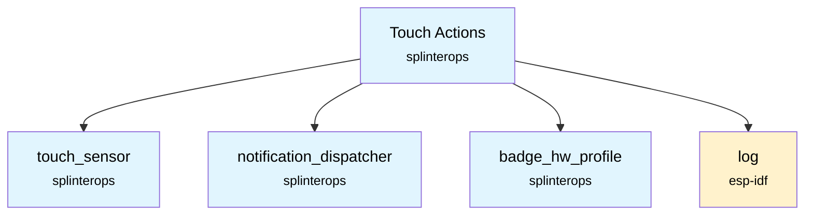

# Touch Actions Component

A touch action processing component that interprets touch sensor events and generates high-level touch action commands for badge functionality.

## Overview

This component acts as a bridge between raw touch sensor events and meaningful user actions. It receives touch sensor notifications, tracks the state of all touch sensors, and delegates to badge-specific command mapping logic to determine what actions the user is trying to perform.

## Features

- **Touch Event Processing**: Receives and processes touch sensor notifications
- **State Tracking**: Maintains current state of all touch sensors
- **Command Generation**: Generates high-level touch action commands
- **Badge-Specific Logic**: Delegates to hardware-specific command mapping
- **Notification Integration**: Publishes touch action commands via notification system

## Files

- `TouchActions.h` - Component interface and data structures
- `TouchActions.c` - Implementation of touch action processing logic

## Usage

### Initialization

```c
#include "TouchActions.h"
#include "NotificationDispatcher.h"

TouchActions touchActions;
NotificationDispatcher notificationDispatcher;

// Example event IDs (use your project's actual values)
const int TOUCH_SENSOR_EVENT_ID = NOTIFICATION_EVENTS_TOUCH_SENSE_ACTION;
const int TOUCH_ACTION_CMD_EVENT_ID = NOTIFICATION_EVENTS_TOUCH_ACTION_CMD;

// Initialize the touch actions system: subscribe to touch sensor event, publish touch action event
esp_err_t ret = TouchActions_Init(&touchActions,
                                  &notificationDispatcher,
                                  TOUCH_SENSOR_EVENT_ID,
                                  TOUCH_ACTION_CMD_EVENT_ID);
if (ret != ESP_OK) {
    ESP_LOGE(TAG, "Failed to initialize touch actions");
}
```

### Touch Action Command Processing

The component automatically processes touch sensor events and generates commands. To handle the generated commands:

```c
// Register a handler for touch action commands
static void TouchActionCommandHandler(void *pObj, esp_event_base_t eventBase, 
                                     int32_t notificationEvent, void *notificationData) {
    TouchActionsCmd *cmd = (TouchActionsCmd *)notificationData;
    
    switch (*cmd) {
        case TOUCH_ACTIONS_CMD_NEXT_LED_SEQUENCE:
            // Handle LED sequence change
            break;
        case TOUCH_ACTIONS_CMD_ENABLE_BLE_PAIRING:
            // Handle BLE pairing enable
            break;
        case TOUCH_ACTIONS_CMD_DISPLAY_VOLTAGE_METER:
            // Show battery voltage
            break;
        // ... handle other commands
    }
}

// Register the handler
NotificationDispatcher_RegisterNotificationEventHandler(
    &notificationDispatcher, 
    NOTIFICATION_EVENTS_TOUCH_ACTION_CMD, 
    &TouchActionCommandHandler, 
    this
);
```

## API Reference

### Functions

#### `TouchActions_Init(TouchActions *this, NotificationDispatcher *pNotificationDispatcher, int touchSensorEvent, int touchActionEvent)`
Initializes the touch actions system, registers for touch sensor notifications, and sets the event used to publish action commands.

**Parameters:**
- `this`: Pointer to TouchActions structure
- `pNotificationDispatcher`: Pointer to notification dispatcher for event handling
- `touchSensorEvent`: Event ID to subscribe to (from `touch_sensor`) for incoming sensor notifications
- `touchActionEvent`: Event ID to publish (action command notifications)

**Returns:**
- `ESP_OK` on success
- ESP error code on failure

### Data Structures

#### `TouchActions`
Main component structure containing:
- `touchSensorValue[]`: Current state of each touch sensor
- `pNotificationDispatcher`: Pointer to notification dispatcher

#### `TouchSensorEvent` (from touch_sensor component)
Touch sensor event types:
- `TOUCH_SENSOR_EVENT_RELEASED` - Sensor not touched
- `TOUCH_SENSOR_EVENT_TOUCHED` - Sensor currently touched
- `TOUCH_SENSOR_EVENT_SHORT_PRESSED` - Short press detected
- `TOUCH_SENSOR_EVENT_LONG_PRESSED` - Long press detected
- `TOUCH_SENSOR_EVENT_VERY_LONG_PRESSED` - Very long press detected

## Touch Action Commands

The component generates the following touch action commands (badge-specific):

- `TOUCH_ACTIONS_CMD_UNKNOWN` - Unknown/invalid command
- `TOUCH_ACTIONS_CMD_CLEAR` - All sensors released
- `TOUCH_ACTIONS_CMD_ENABLE_TOUCH` - Enable touch functionality
- `TOUCH_ACTIONS_CMD_DISABLE_TOUCH` - Disable touch functionality
- `TOUCH_ACTIONS_CMD_NEXT_LED_SEQUENCE` - Cycle to next LED pattern
- `TOUCH_ACTIONS_CMD_PREV_LED_SEQUENCE` - Cycle to previous LED pattern
- `TOUCH_ACTIONS_CMD_DISPLAY_VOLTAGE_METER` - Show battery voltage
- `TOUCH_ACTIONS_CMD_ENABLE_BLE_PAIRING` - Enable Bluetooth pairing
- `TOUCH_ACTIONS_CMD_DISABLE_BLE_PAIRING` - Disable Bluetooth pairing
- `TOUCH_ACTIONS_CMD_TOGGLE_SYNTH_MODE_ENABLE` - Toggle synthesizer mode
- `TOUCH_ACTIONS_CMD_NETWORK_TEST` - Perform network connectivity test

## Event Flow

1. **Touch Sensor Events**: Raw touch sensor hardware generates events
2. **Touch Sensor Component**: Processes hardware events and publishes notifications
3. **Touch Actions Component**: Receives notifications and updates sensor state
4. **Command Mapping**: Calls badge-specific `ParseTouchActions()` function
5. **Command Publication**: Publishes generated commands via notification system
6. **Application Handlers**: Application components handle the high-level commands

## Badge-Specific Integration

The component relies on badge-specific command mapping logic provided by the `badge_hw_profile` component:

```c
// Implemented in badge_hw_profile for each badge type
TouchActionsCmd ParseTouchActions(TouchActions *this);
```

This function analyzes the current touch sensor states and returns the appropriate command based on the badge's specific touch patterns.

## Notification Events

### Subscribed Events
- `NOTIFICATION_EVENTS_TOUCH_SENSE_ACTION` - Touch sensor state changes

### Published Events  
- `NOTIFICATION_EVENTS_TOUCH_ACTION_CMD` - Generated touch action commands

## Dependencies

- `touch_sensor` component for touch sensor data structures and events
- `notification_dispatcher` component for event handling
- `badge_hw_profile` component for badge-specific command mapping logic
- ESP-IDF `log` component for logging



## Integration

To use this component in your project, include it in your component's CMakeLists.txt:

```cmake
idf_component_register(
    # ... your sources
    REQUIRES touch_actions
)
```

## Thread Safety

The component is designed to be thread-safe when used with the notification dispatcher system. All state updates occur within the notification event handler context.
