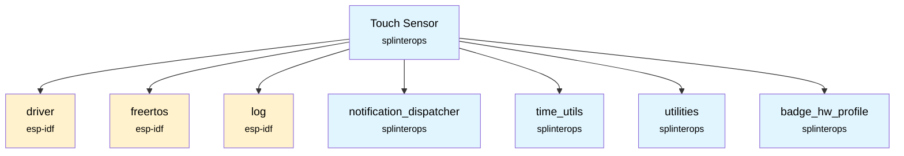
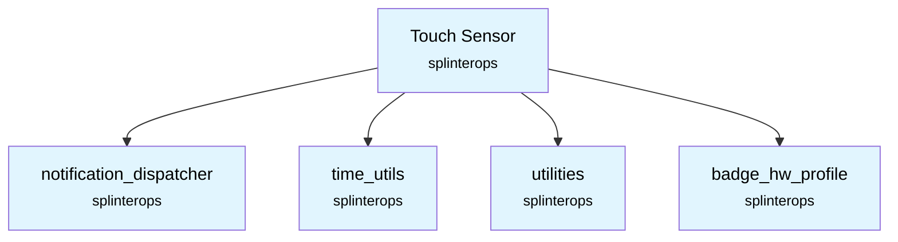

# Touch Sensor Component

A low-level touch sensor driver component that interfaces with ESP32 capacitive touch hardware and provides touch event detection with multiple press types.

## Overview

This component manages the ESP32's capacitive touch sensor hardware, providing touch detection, filtering, and event generation. It supports multiple touch event types including touch, short press, long press, and very long press detection with configurable thresholds.

## Features

- **Hardware Interface**: Direct integration with ESP32 capacitive touch sensor hardware
- **Multi-level Touch Detection**: Supports touch, short press, long press, and very long press events
- **Touch Filtering**: Built-in filtering to reduce noise and false triggers
- **Event Notification**: Publishes touch events via notification dispatcher system
- **Touch Enable/Disable**: Runtime control of touch sensor functionality
- **Stuck Touch Recovery**: Automatic recovery from stuck touch sensors
- **Badge-Specific Configuration**: Uses badge hardware profile for sensor count and mapping

## Touch Event Types

- `TOUCH_SENSOR_EVENT_RELEASED` - Sensor not being touched
- `TOUCH_SENSOR_EVENT_TOUCHED` - Sensor currently being touched
- `TOUCH_SENSOR_EVENT_SHORT_PRESSED` - Short press detected (>1 second)
- `TOUCH_SENSOR_EVENT_LONG_PRESSED` - Long press detected (>3 seconds)  
- `TOUCH_SENSOR_EVENT_VERY_LONG_PRESSED` - Very long press detected (>5 seconds)

## Configuration Parameters

```c
#define TOUCH_ACTIVE_DELTA_THRESHOLD         (150)    // Touch detection sensitivity
#define TOUCH_SAMPLE_PERIOD_MS               (100)    // Sampling frequency
#define TOUCH_SHORT_PRESS_THRESHOLD          (1000)   // Short press duration (ms)
#define TOUCH_LONG_PRESS_THRESHOLD           (3000)   // Long press duration (ms)
#define TOUCH_SUPER_LONG_PRESS_THRESHOLD     (5000)   // Very long press duration (ms)
#define TOUCH_STUCK_RELEASE_THRESHOLD        (7000)   // Stuck sensor recovery (ms)
```

## Files

- `TouchSensor.h` - Component interface and data structures
- `TouchSensor.c` - Implementation with ESP32 touch hardware interface

## Usage

### Initialization

```c
#include "TouchSensor.h"
#include "NotificationDispatcher.h"
#include "NotificationEvents.h"

TouchSensor touchSensor;
NotificationDispatcher notificationDispatcher;

// Initialize the touch sensor system
esp_err_t ret = TouchSensor_Init(&touchSensor, &notificationDispatcher, 
                                TOUCH_SENSOR_TASK_PRIORITY, 
                                NOTIFICATION_EVENTS_TOUCH_SENSE_ACTION);
if (ret != ESP_OK) {
    ESP_LOGE(TAG, "Failed to initialize touch sensor");
}
```

### Handling Touch Events

```c
// Register a handler for touch sensor events
static void TouchSensorEventHandler(void *pObj, esp_event_base_t eventBase, 
                                   int32_t notificationEvent, void *notificationData) {
    TouchSensorEventNotificationData *touchData = (TouchSensorEventNotificationData *)notificationData;
    
    ESP_LOGI(TAG, "Touch sensor %d: %s", 
             touchData->touchSensorIdx,
             (touchData->touchSensorEvent == TOUCH_SENSOR_EVENT_TOUCHED) ? "TOUCHED" :
             (touchData->touchSensorEvent == TOUCH_SENSOR_EVENT_SHORT_PRESSED) ? "SHORT_PRESSED" :
             (touchData->touchSensorEvent == TOUCH_SENSOR_EVENT_LONG_PRESSED) ? "LONG_PRESSED" :
             (touchData->touchSensorEvent == TOUCH_SENSOR_EVENT_VERY_LONG_PRESSED) ? "VERY_LONG_PRESSED" :
             "RELEASED");
}

// Register the handler
NotificationDispatcher_RegisterNotificationEventHandler(
    &notificationDispatcher, 
    NOTIFICATION_EVENTS_TOUCH_SENSE_ACTION, 
    &TouchSensorEventHandler, 
    this
);
```

### Runtime Control

```c
// Enable/disable touch sensing
TouchSensor_SetTouchEnabled(&touchSensor, true);   // Enable
TouchSensor_SetTouchEnabled(&touchSensor, false);  // Disable

// Check if a specific touch sensor is active
int sensorIndex = 0;  // First sensor
bool isActive = TouchSensor_GetTouchSensorActive(&touchSensor, sensorIndex);
```

## API Reference

### Functions

#### `TouchSensor_Init(TouchSensor *this, NotificationDispatcher *pNotificationDispatcher, int touchSensorPriority, int touchSensorNotificationEvent)`
Initializes the touch sensor system and starts the touch detection task.

**Parameters:**
- `this`: Pointer to TouchSensor structure
- `pNotificationDispatcher`: Pointer to notification dispatcher
- `touchSensorPriority`: FreeRTOS task priority for touch sensor task
- `touchSensorNotificationEvent`: Notification event ID to publish

**Returns:**
- `ESP_OK` on success
- ESP error code on failure

#### `TouchSensor_GetTouchSensorActive(TouchSensor *this, int pad_num)`
Gets the current active state of a specific touch sensor.

**Parameters:**
- `this`: Pointer to TouchSensor structure
- `pad_num`: Touch sensor index (0 to TOUCH_SENSOR_NUM_BUTTONS-1)

**Returns:**
- `1` if sensor is active (touched)
- `0` if sensor is inactive (not touched)

#### `TouchSensor_SetTouchEnabled(TouchSensor *this, bool enabled)`
Enables or disables touch sensor functionality at runtime.

**Parameters:**
- `this`: Pointer to TouchSensor structure
- `enabled`: `true` to enable touch sensing, `false` to disable

**Returns:**
- `ESP_OK` on success
- ESP error code on failure

### Data Structures

#### `TouchSensor`
Main component structure containing:
- `pNotificationDispatcher`: Pointer to notification dispatcher
- `prevDeltaValues[][]`: Historical delta values for filtering
- `prevTouchValue[]`: Previous touch state for each sensor
- `touchSensorActive[]`: Current active state for each sensor
- `touchSensorActiveTimeStamp[]`: Timestamp when sensor became active
- `touch_notify_loop_task`: Event loop handle for notifications
- `touchSensorNotificationEvent`: Event ID for notifications
- `touchEnabled`: Current enable/disable state

#### `TouchSensorEventNotificationData`
Event data structure containing:
- `touchSensorEvent`: Type of touch event detected
- `touchSensorIdx`: Index of the touch sensor (0 to TOUCH_SENSOR_NUM_BUTTONS-1)

## Touch Detection Algorithm

1. **Hardware Sampling**: ESP32 touch hardware continuously samples capacitive values
2. **Delta Calculation**: Component calculates delta from baseline values
3. **Threshold Comparison**: Compares delta against `TOUCH_ACTIVE_DELTA_THRESHOLD`
4. **State Tracking**: Tracks touch state changes and timestamps
5. **Press Duration**: Calculates press duration for different event types
6. **Event Generation**: Publishes appropriate touch events via notification system
7. **Stuck Recovery**: Automatically releases sensors stuck for too long

## Hardware Configuration

The component automatically configures the ESP32 touch sensor hardware:

- **Touch Pad Count**: Determined by `TOUCH_SENSOR_NUM_BUTTONS` from badge hardware profile
- **Filter Mode**: Enabled with 50ms period for noise reduction
- **Threshold**: Set to 0 (uses delta-based detection instead)
- **Sampling**: Continuous sampling with 100ms processing period

## Badge Integration

The component integrates with the badge hardware profile system:

```c
#include "TouchSensorNames.h"  // Badge-specific sensor definitions

// Number of sensors defined by badge type
#define TOUCH_SENSOR_NUM_BUTTONS  // From badge hardware profile
```

## Notification Events

### Published Events
- `NOTIFICATION_EVENTS_TOUCH_SENSE_ACTION` - Touch sensor state changes

Event data includes sensor index and event type for processing by higher-level components.

## Dependencies

- ESP-IDF `driver` component for touch sensor hardware interface
- ESP-IDF `freertos` component for task management
- ESP-IDF `log` component for logging
- `notification_dispatcher` component for event publishing
- `time_utils` component for timestamp management
- `utilities` component for utility functions
- `badge_hw_profile` component for hardware-specific definitions



## Integration

To use this component in your project, include it in your component's CMakeLists.txt:

```cmake
idf_component_register(
    # ... your sources
    REQUIRES touch_sensor
)
```

## Performance Considerations

- **Task Priority**: Set appropriate task priority to balance responsiveness with system performance
- **Sampling Rate**: 100ms sampling provides good balance between responsiveness and CPU usage
- **Memory Usage**: Component maintains minimal state per touch sensor
- **Interrupt Handling**: Uses polling approach to avoid interrupt overhead

## Thread Safety

The component is designed to be thread-safe:
- Touch sensor task runs independently
- State updates are atomic
- Notification publishing is thread-safe via notification dispatcher

## SplinterOps Dependency Tree


