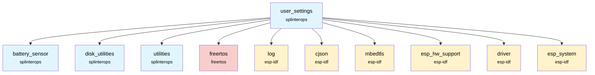
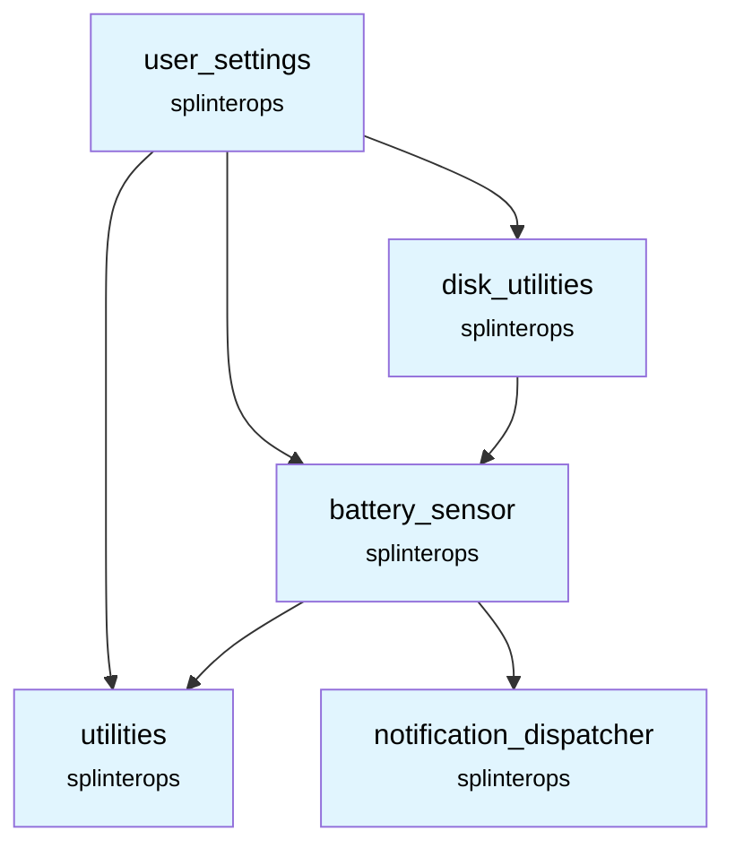

# User Settings Component

Manages persistent user-configurable settings (sounds, vibrations, WiFi credentials, pairing ID, selected index) and exposes a thread-safe API. Periodically flushes updates to disk and initializes unique per-badge identifiers.

## Overview

`user_settings` provides:
- A `UserSettings` struct with an in-memory copy of user settings
- A background task that writes settings to disk periodically or when updated
- Helpers to update settings from JSON payloads

Settings are stored at `CONFIG_MOUNT_PATH "/settings"` as a binary blob of `UserSettingsFile`.

## Features

- **Thread-safe updates** using a FreeRTOS mutex
- **Periodic persistence** to filesystem (every 60 seconds)
- **JSON ingestion** via cJSON
- **Badge identity** and key generation with salted SHA-256 and Base64

## API

### `esp_err_t UserSettings_Init(UserSettings *this, BatterySensor * pBatterySensor, int userSettingsPriority)`
Initializes the component, loads settings from disk (or creates defaults), and starts the background task pinned to the app CPU.

### `esp_err_t UserSettings_UpdateFromJson(UserSettings *this, uint8_t * settingsJson)`
Parses a JSON buffer and updates settings (vibrations, sounds, ssid, pass). Triggers persistence.

### `esp_err_t UserSettings_SetPairId(UserSettings *this, uint8_t * pairId)`
Sets or clears the pairing ID.

### `esp_err_t UserSettings_SetSelectedIndex(UserSettings *this, uint32_t selectedIndex)`
Updates the selected index.

## Configuration

- `CONFIG_MOUNT_PATH`: Filesystem mount path used for the settings file
- Uses SHA engine and CRTs provided by ESP-IDF/mbedTLS

## Dependencies



## SplinterOps Dependency Tree



## Integration

Add to your main component CMake:

```cmake
idf_component_register(
    # ... your sources
    REQUIRES user_settings
)
```

Initialize during bring-up (example):

```c
ESP_ERROR_CHECK(UserSettings_Init(&this->userSettings, &this->batterySensor, USER_SETTINGS_TASK_PRIORITY));
```

## Component Structure

```
components/user_settings/
├── CMakeLists.txt
├── UserSettings.c
├── UserSettings.h
└── README.md
```
