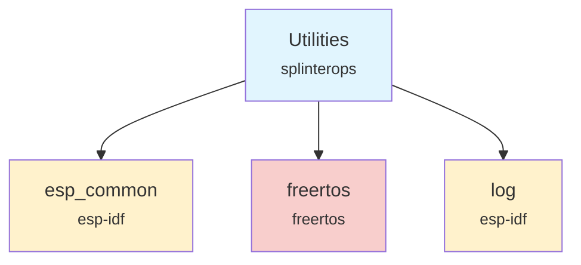

# Utilities Component

The Utilities component provides common utility functions and badge-specific constants for the badge firmware, including badge type detection, random number generation, and BLE device naming.

## Overview

The Utilities component serves as a shared library of helper functions used throughout the badge firmware. It provides badge type identification based on compile-time definitions, random number generation, and device naming functionality for different badge variants.

## Features

- **Badge type detection**: Runtime identification of badge variant (TRON, REACTOR, CREST, FMAN25)
- **Random number generation**: Cryptographically secure random numbers using ESP32 hardware
- **BLE device naming**: Automatic device name assignment based on badge type
- **Utility macros**: MIN/MAX macros for common operations
- **Compile-time configuration**: Badge-specific behavior through preprocessor definitions

## API Functions

### `GetBadgeType(void)`
Returns the current badge type based on compile-time definitions.

**Parameters:** None

**Returns:** `BadgeType` enum value (BADGE_TYPE_TRON, BADGE_TYPE_REACTOR, BADGE_TYPE_CREST, BADGE_TYPE_FMAN25, or BADGE_TYPE_UNKNOWN)

### `ParseBadgeType(int badgeTypeNum)`
Converts an integer to a BadgeType enum value.

**Parameters:**
- `badgeTypeNum`: Integer representation of badge type (1-4)

**Returns:** `BadgeType` enum value corresponding to the input number

### `GetRandomNumber(uint32_t min, uint32_t max)`
Generates a cryptographically secure random number within the specified range.

**Parameters:**
- `min`: Minimum value (inclusive)
- `max`: Maximum value (inclusive)

**Returns:** Random number between min and max (inclusive)

### `GetBadgeBleDeviceName(char *buffer, uint32_t bufferSize)`
Retrieves the BLE device name for the current badge type.

**Parameters:**
- `buffer`: Destination buffer for the device name
- `bufferSize`: Size of the destination buffer

**Returns:** None (writes to buffer)

## Badge Types

The component supports the following badge variants:

- **TRON (IWCv1)**: Original badge design
- **REACTOR (IWCv2)**: Second generation badge
- **CREST (IWCv3)**: Third generation badge  
- **FMAN25 (IWCv4)**: Fourth generation badge (default)

## Usage Example

```c
#include "Utilities.h"

// Get current badge type
BadgeType currentBadge = GetBadgeType();
switch (currentBadge) {
    case BADGE_TYPE_TRON:
        ESP_LOGI("BADGE", "Running on TRON badge");
        break;
    case BADGE_TYPE_FMAN25:
        ESP_LOGI("BADGE", "Running on FMAN25 badge");
        break;
    default:
        ESP_LOGI("BADGE", "Unknown badge type");
        break;
}

// Generate random number
uint32_t randomValue = GetRandomNumber(1, 100);
ESP_LOGI("RANDOM", "Generated: %lu", randomValue);

// Get BLE device name
char deviceName[32];
GetBadgeBleDeviceName(deviceName, sizeof(deviceName));
ESP_LOGI("BLE", "Device name: %s", deviceName);

// Use utility macros
int a = 10, b = 20;
int maximum = MAX(a, b);  // Returns 20
int minimum = MIN(a, b);  // Returns 10
```

## Dependencies



## Component Structure

```
components/utilities/
├── CMakeLists.txt    # Component build configuration
├── Utilities.c       # Implementation
├── Utilities.h       # Public API
└── README.md        # This documentation
```

## Compile-time Configuration

Badge type is determined by preprocessor definitions set in the main CMakeLists.txt:

- `TRON_BADGE`: Enables TRON badge configuration
- `REACTOR_BADGE`: Enables REACTOR badge configuration  
- `CREST_BADGE`: Enables CREST badge configuration
- `FMAN25_BADGE`: Enables FMAN25 badge configuration (default)

## Thread Safety

All functions in this component are thread-safe:
- `GetBadgeType()` and `ParseBadgeType()` are read-only operations
- `GetRandomNumber()` uses ESP32's hardware random number generator
- `GetBadgeBleDeviceName()` performs read-only string operations

## Performance Characteristics

- **Badge type detection**: O(1) compile-time constant
- **Random number generation**: Hardware-accelerated, very fast
- **Device name lookup**: O(1) string copy operation
- **Memory overhead**: Minimal - only static string constants
