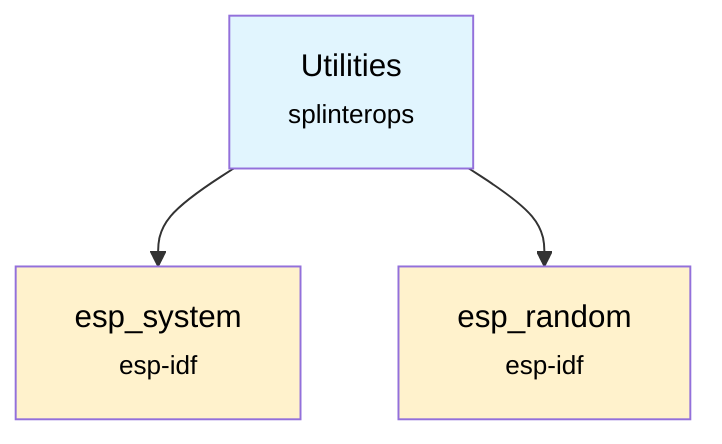

# Utilities Component

The Utilities component provides common utility helpers used across the firmware. Currently, it offers utility macros and a cryptographically secure random number generator.

## Overview

This component serves as a shared library of helper functions used throughout the badge firmware. It currently provides:
- Utility macros (`MIN`/`MAX`)
- Random number generation using the ESP32 hardware RNG

## Features

- **Utility macros**: MIN/MAX macros for common operations
- **Random number generation**: Cryptographically secure random numbers using ESP32 hardware

## API Functions

### `GetRandomNumber(uint32_t min, uint32_t max)`
Generates a cryptographically secure random number within the specified range.

**Parameters:**
- `min`: Minimum value (inclusive)
- `max`: Maximum value (inclusive)

**Returns:** Random number between min and max (inclusive)

## Badge Types
Not applicable. Badge type identification and BLE naming have moved to the `badge_hw_profile` component.

## Usage Example

```c
#include "Utilities.h"

// Generate random number
uint32_t randomValue = GetRandomNumber(1, 100);
ESP_LOGI("RANDOM", "Generated: %lu", randomValue);

// Use utility macros
int a = 10, b = 20;
int maximum = MAX(a, b);  // Returns 20
int minimum = MIN(a, b);  // Returns 10
```

## Dependencies



## Component Structure

```
components/utilities/
├── CMakeLists.txt    # Component build configuration
├── Utilities.c       # Implementation
├── Utilities.h       # Public API
└── README.md        # This documentation
```

## Thread Safety

All functions in this component are thread-safe:
- `GetRandomNumber()` uses ESP32's hardware random number generator
- `MIN`/`MAX` are macros

## Performance Characteristics

- **Random number generation**: Hardware-accelerated, very fast
- **Macro operations**: O(1)
- **Memory overhead**: Minimal

