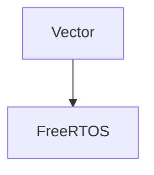

# Vector Component

A C implementation of a dynamic array similar to C++ std::vector. This component provides a generic container that can hold elements of any type and automatically handles memory management.

## Features

- Generic container for any data type
- Dynamic memory allocation with automatic resizing
- Static memory allocation option for memory-constrained environments
- API similar to C++ std::vector
- Thread-safe operations

## API

The Vector component provides the following key functions:

- `Vector_Init` / `Vector_InitStatic` - Initialize a vector with dynamic or static memory allocation
- `Vector_PushBack` / `Vector_PopBack` - Add/remove elements at the end
- `Vector_Insert` / `Vector_Erase` - Add/remove elements at specific positions
- `Vector_At` / `Vector_Front` / `Vector_Back` - Access elements
- `Vector_Size` / `Vector_Capacity` / `Vector_Empty` - Query vector state
- `Vector_Reserve` / `Vector_Resize` / `Vector_ShrinkToFit` - Manage capacity

## Usage Example

```c
#include "Vector.h"

// Dynamic allocation example
Vector dynamicVector;
Vector_Init(&dynamicVector, sizeof(int), 10);

int value = 42;
Vector_PushBack(&dynamicVector, &value);

int* pElement = (int*)Vector_At(&dynamicVector, 0);
// *pElement == 42

Vector_Deinit(&dynamicVector);

// Static allocation example
int staticBuffer[64];
Vector staticVector;
Vector_InitStatic(&staticVector, sizeof(int), staticBuffer, 64);

// Use the vector...

Vector_Deinit(&staticVector);
```

## Mermaid Component Diagram


