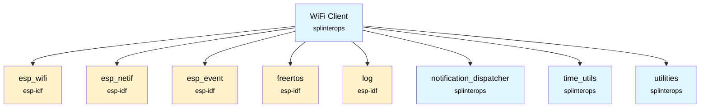
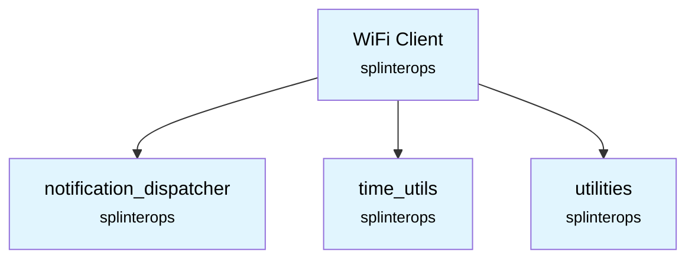

# WiFi Client Component

A lightweight WiFi station (STA) client that manages connection lifecycle, retries, and simple client ref-counting so multiple subsystems can request connectivity concurrently.

## Overview

`wifi_client` wraps ESP-IDF WiFi station APIs and provides:
- Connection state machine and retry handling
- Blocking and non-blocking connect flows
- Deferred connection with a requested wait window
- Client reference counting (WiFi stays enabled until all clients release)
- Event-based completion notification via `NotificationDispatcher`

## Features

- **Deferred start:** request a connection after N milliseconds; shortest request wins
- **Blocking wait:** wait until connected or failed
- **Ref counted:** `Disconnect()` by each user; WiFi stops when count goes to zero
- **Auto-retry:** limited retries on disconnect
- **AP selection:** scans and connects to the strongest matching AP (custom SSID first, then DEF CON fallback)

## Public API

Declared in `components/wifi_client/WifiClient.h`.

```c
esp_err_t WifiClient_Init(
    WifiClient *this,
    NotificationDispatcher *pNotificationDispatcher,
    uint8_t *ssid,
    uint8_t *password,
    int testCompleteEventId,
    int wifiTaskPriority);

WifiClient_State WifiClient_Enable(WifiClient *this);
WifiClient_State WifiClient_RequestConnect(WifiClient *this, uint32_t waitTimeMS);
esp_err_t        WifiClient_Disconnect(WifiClient *this);
esp_err_t        WifiClient_WaitForConnected(WifiClient *this);
WifiClient_State WifiClient_GetState(WifiClient *this);
void             WifiClient_TestConnect(WifiClient *this);
```

### States

```c
typedef enum WifiClient_State_e {
    WIFI_CLIENT_STATE_UNKNOWN = 0,
    WIFI_CLIENT_STATE_DISCONNECTED,
    WIFI_CLIENT_STATE_WAITING,
    WIFI_CLIENT_STATE_ATTEMPTING,
    WIFI_CLIENT_STATE_CONNECTING,
    WIFI_CLIENT_STATE_CONNECTED,
    WIFI_CLIENT_STATE_FAILED,
} WifiClient_State;
```

## Usage

```c
#include "WifiClient.h"
#include "NotificationDispatcher.h"

// ... create/initialize NotificationDispatcher elsewhere ...

WifiClient wifiClient;

// Provide credentials and event/prio
ESP_ERROR_CHECK(WifiClient_Init(&wifiClient,
                                &notificationDispatcher,
                                (uint8_t*)userSettings.settings.wifiSettings.ssid,
                                (uint8_t*)userSettings.settings.wifiSettings.password,
                                NOTIFICATION_EVENTS_NETWORK_TEST_COMPLETE,
                                WIFI_CONTROL_TASK_PRIORITY));

// Option A: immediate connect
WifiClient_Enable(&wifiClient);
if (WifiClient_WaitForConnected(&wifiClient) == ESP_OK) {
    // connected
}

// Option B: deferred connect (e.g., request within 1500ms window)
WifiClient_RequestConnect(&wifiClient, 1500);
// You can poll state or block:
if (WifiClient_WaitForConnected(&wifiClient) == ESP_OK) {
    // connected
}

// When done, each client must release
ESP_ERROR_CHECK(WifiClient_Disconnect(&wifiClient));
```

### Test connect helper

`WifiClient_TestConnect()` performs a connect cycle and emits a boolean `success` via `NotificationDispatcher_NotifyEvent` using `testCompleteEventId`.

## Notifications

This component uses `NotificationDispatcher` for an optional test-complete notification:
- Publishes: `testCompleteEventId` (data: `bool success`)

It does not subscribe to external app events; WiFi driver events are handled internally via ESP-IDF event loop handlers registered in `WifiClient_Init()`.

## Dependencies

CMake: `components/wifi_client/CMakeLists.txt`

```cmake
idf_component_register(
    SRCS "WifiClient.c"
    INCLUDE_DIRS "."
    REQUIRES esp_wifi esp_netif esp_event freertos log notification_dispatcher time_utils utilities
)
```

Runtime dependencies used in code:
- `esp_wifi`, `esp_netif`, `esp_event`
- `freertos` (tasks, semaphores, event groups)
- `log`
- Local components: `notification_dispatcher`, `time_utils`, `utilities`

Note: `UserSettings.h` is included for the `WifiSettings` type, but credentials are provided directly to `WifiClient_Init()`; no `user_settings` component is required.



## Configuration

The following Kconfig options are referenced by code (ensure they exist in your sdkconfig):
- `CONFIG_WIFI_MAX_RETRY`: max reconnect attempts
- `CONFIG_WIFI_PROV_SCAN_MAX_ENTRIES`: maximum AP scan entries

Power save mode is set to `WIFI_PS_MIN_MODEM`.

## Component Structure

```
components/wifi_client/
├── CMakeLists.txt
├── README.md
├── WifiClient.c
└── WifiClient.h
```

## Thread Safety

- Internal operations are guarded by a mutex (`clientMutex`).
- Public APIs that mutate state take the mutex internally.
- Event handler also acquires the same mutex.

## Notes

- A task `WifiClientTask` is created in `WifiClient_Init()` pinned to `APP_CPU_NUM` with stack size `configMINIMAL_STACK_SIZE * 2` and priority `wifiTaskPriority`.
- AP selection order: provided SSID first, then `defconWifiSettings` fallback if present.

## SplinterOps Dependency Tree


